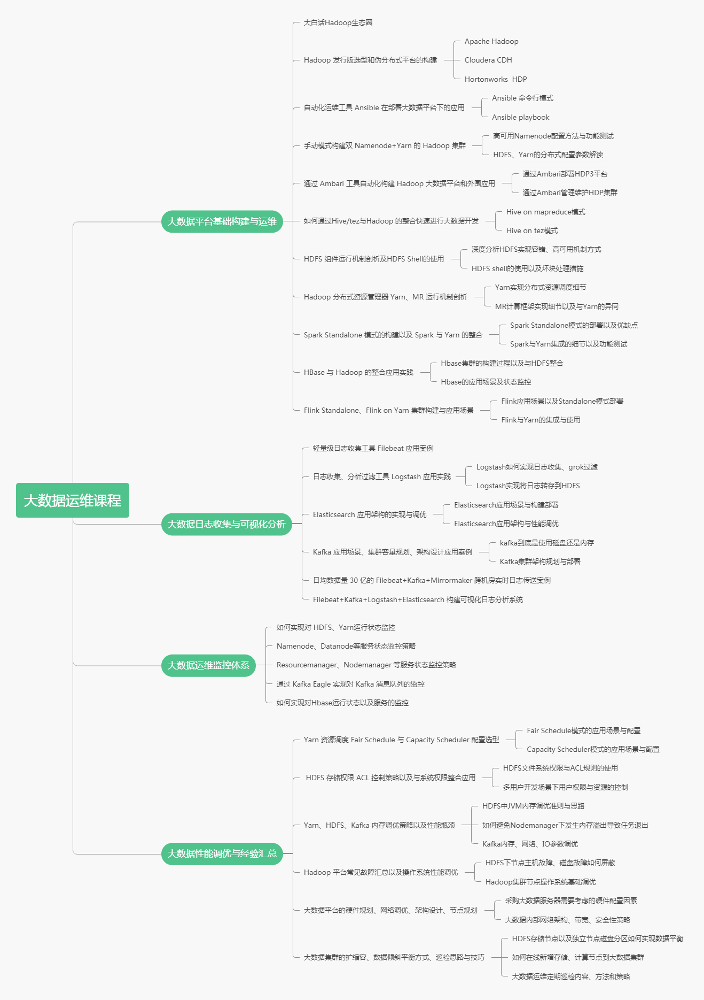

# 开篇词：掌握大数据，把握未来


社群福利
加入社群获得以下福利：
① 讲师交流： 订阅后可加入「 大数据运维交流群 」与讲师直面交流
② 独家资料： 进群后领取 「 大数据运维课程PPT」
③ 加餐内容： 不定期社群专属直播、福利包

—— > 仅限 500 人，戳此加入 <——

你好，欢迎来到《大数据运维实战》专栏，我是高俊峰。

入行以来，我从事大数据运维也有十多年了，期间我做过系统运维、DBA，也做过大数据分析师，最后选择了大数据运维方向，曾设计并管理超过千台、PB 级的数据平台。在这期间， 我见证并目睹了国内大数据行业发展的历程，也看到了目前大家在大数据学习、工作、发展等方面的一些问题，比如：

做传统运维（网络运维、系统运维、DBA等）多年，但受到云计算、虚拟化的冲击，竞争力日渐低下，要升职加薪变得异常困难；
企业没有专职大数据运维，开发兼职运维，大数据平台经常出问题，没有专人解决；
想进入大数据领域，但不知道学习什么知识，如何系统地去学习，以及就业方式等诸多问题。
这可能是大部分人面临的问题，在我个人的运维从业过程中，也同样经历了职业方向选型时的迷茫期、职业高速发展时的提升期、职业定型时的运筹帷幄期 3 个阶段。

**迷茫期**，平台搭建经常出问题，也不知道怎么解决，只能根据错误提示进行搜索查找，而在找到答案后，也不清楚这样修改是否正确，只能尝试修改，发现不行就回滚恢复。也就是在这种模棱两可的状态下，我发现：要能处理故障和问题，一定要对大数据每个组件的运行机制、原理有清晰的认识，这样才能够知道故障是如何发生的，以及如何避免再次发生。

**提升期**，在慢慢摸清了大数据的门道后，思路逐渐清晰了，此时已经慢慢捋清了大数据运维的难点和重点，比如掌握每个组件的内部原理后，再进行有目的的故障排错和修改。现在遇到大数据平台的基础问题，基本能马上定位问题，进而快速解决问题。

**运筹帷幄期**，此阶段接触更多的是对大数据平台的调优、架构优化，这也是大数据运维最难的一个部分，不同的应用场景和需求，注定了调优不是一成不变的，它也有一套思路和方法。而大数据应用架构也是在企业应用需求变化中不断进行调整，因此这个阶段要求的是业务需求和大数据平台之间的一个平衡，你需要了解业务模式和特点，然后有针对性地对大数据平台进行架构调整、资源优化。

**大数据人才紧缺**
如今，大数据已经广泛应用于各行各业，阿里、腾讯、京东、美团、字节跳动等互联网公司都有自己的大数据平台，大数据运维职业的平均薪资在 20K 或以上（北上深杭广）。而且，由于国家大力倡导实施大数据战略，这就出现了企业对大数据分析、开发人才的需求量激增，进而导致大数据运维人才也非常紧缺。

大数据战略的落地，必然会有大批技术人员涌入大数据领域，传统运维人员由于具有多年的运维基础，转型大数据运维是顺理成章的事情，并随之带来翻倍的高额薪资。目前，国内大数据市场还是一片蓝海，全面大数据化还有相当长的路要走，所以未来职业发展不可限量。

2019 年大数据人才就业趋势报告显示，中国当下大数据从业人才约有 30 万，未来 3 ~ 5 年人才需求量将达到 180 万。下图中是拉勾网对大数据运维职位的招聘信息，从中我们可以看出企业招聘的实际需求以及薪资情况。


大数据运维是一个新兴职业，在整个国家都在倡导和实施大数据应用落地建设之际，大数据运维必然有更多的职位需求和更大的发展前景。

如果你现在是一名 Linux 运维工程师、DBA、网络运维工程师、IT 支持工程师，正苦于薪资太少、竞争力差，或者徘徊在职业转型的苦恼中，那么大数据运维这个职位绝对是你的首选：

因为你已经有了一定的技能积累，而这些技能可以直接拿来运用到大数据运维中；
其次，这个职位不需要太多开发技能，所以你不用去单独学习一门语言；
最后，大数据运维是整个运维行业中薪资最高的，这在一定程度上也代表了运维的发展方向。
很多想转行大数据运维的都有个疑问：大数据需要会开发，而我没做过开发，也不想去学开发，那能学大数据运维吗？

实际上，大数据运维根本不需要很多高深的技能，懂一点 Linux、网络和自动化运维的知识，基本就可以学大数据运维课程了，而开发能力非必选项。

此外，学大数据运维，注重的是理论与实践相结合，也就是首先要理解概念、原理，有了这些理论作为支撑，才能进入实践阶段，实践过程就是动手实战、反复操作的过程。但如果没有实践经验，企业是不会贸然让你上手去操作，这种困境怎么破呢？

如何有效学习和入手？
缺少相关学习资料，是第一个难题。现在市面上的大数据类书籍或者课程，大部分都是基于大数据开发、大数据分析方向的，其核心就是教你如何通过一门编程语言来分析数据。而讲到大数据运维方向（架构设计、运维监控、性能调优）的资料就非常匮乏了。

究其原因，这主要是开发方向的技术点相对简单，而运维方向需要更多的经验积累，比如什么架构才能支撑这个数据量、什么资源配置才能满足分析需求，这需要你实际接触过、操作过才能给出答案，而不是靠理论或者猜测。

学习大数据运维的难点，非常重要的一点，就在于接触不到实际的环境，没有现成可学习的架构和案例。而大数据运维中的架构设计、容量规划、性能调优是要和具体的业务需求结合起来综合考虑的，所以获取这部分经验很难，仅靠自学是无法实现的。

这个专栏帮你很好地解决了以上问题。

我在专栏中，详细讲解了大数据运维平台的各种运维架构和实施案例，而且每个案例都基于企业实际的应用环境来讲解。对运维人员因为刚入行或没实际经验而接触不到的架构设计、容量规划，性能调优，我也都是以企业实际应用需求来展开介绍的。可以说，这个专栏基本解决了你学习大数据运维的最大难题。

**课程设置**
本课程共计七大模块， 26 个课时。主要介绍大数据运维平台的架构设计与部署、大数据平台的监控告警、大数据平台的性能调优三大部分内容。

首先从大数据生态圈基础讲起；然后教你如何构建大数据平台；接着是如何运维这个平台，以及讲解跟这个平台相关的一些大数据组件；最后从大数据架构实现、调优方向，教你如何做一个质的提升。纵观全局，整个课程是一个由点及线、由线及面、循序渐进的一个学习过程，非常容易上手。

下图是本专栏内容的一个思维导图，你可以从中了解更多运维技术内容和细节。



**模块一，Hadoop 大数据平台的规划与部署。**该模块主要讲解了 Hadoop 大数据平台的搭建与基础配置， 以及两种 Hadoop 集群部署方式，分别是手动部署和 Ambari 自动部署。

掌握这些内容，可以帮助你快速为企业部署大数据平台。这是大数据运维的第一步，此部分内容要求熟练掌握。

**模块二，Hadoop 分布式架构解析。**该模块主要讲解了分布式文件系统 HDFS 和分布式资源管理器 Yarn 的运行机制，以及内部实现细节。

掌握后，对于大数据平台出现的一些简单故障，你可以快速定位并解决。这是大数据运维的第二步，此时你已经具备了处理大数据平台故障的能力。

**模块三，Hadoop 外围应用整合实战。**该模块主要讲解了大数据平台下如何整合一些外围应用，主要是 Spark、Flink 与 Yarn 的整合应用，以及 HBase 集群的部署。

掌握后，你的大数据运维能力将得到质的提升。这是大数据运维的第三步，大数据平台从离线计算扩展到内存计算（Spark）和实时计算（Flink）。

**模块四，Hadoop 大数据平台数据收集应用实践。**该模块主要讲解了 ELK/EFK 应用套件如何实现日志数据收集以及快速查询。首先介绍了 Filebeat 和 Logstash 两款日志收集工具的功能，接着介绍了如何实现日志的收集、过滤和传输，最后介绍了如何通过 Elasticsearch 实现数据的快速检索。

掌握此模块内容后，你就可以根据企业需求去收集需要的业务数据，从而实现快速查询。这是大数据运维的第四步，如何获取数据并对数据进行过滤、分析，最后存储到 HDFS 上。

**模块五，大数据平台日志传输与可视化应用实践。**该模块主要讲解了海量数据环境中如何实现数据的实时传输，并通过 Kibana 实现可视化展示。

掌握了这部分内容，你就已经具备了设计大数据平台下实时查询、实时展示架构的能力。这是大数据运维的第五步，至此，你已经掌握了大数据生态链中的数据收集、数据传输、数据存储、数据分析四个方向的所有运维技术。

**模块六，大数据平台运维监控体系的构建。**该模块主要讲解了如何对大数据平台下每个组件的运行状态、服务状态进行监控。

作为大数据运维中最重要的一个环节，监控告警是你必须掌握的内容，也是运维质量的保障。

**模块七，大数据平台性能调优与运维经验汇总。**该模块主要讲解了大数据运维中常见的故障处理方法、集群扩缩容、集群调度策略选型、集群资源分配与权限管理等，还从全局的角度介绍了如何从零开始构建一个大数据平台，以及集群参数调优、内存调优等经验和技巧。

掌握后，你对大数据平台的运维基本上可以做到游刃有余。这是大数据运维的终极步骤，至此，你已经学完了大数据运维的所有相关内容了。

本专栏虽然是大数据运维实战专栏，但除了大数据运维人员，专栏中的第二、三、四、五、七模块内容，对大数据开发人员也有极高的学习和参考价值，这些内容能够帮助开发人员在数据架构、数据可视化展示、大数据调优等方面拓展视野，同时帮助其建立宏观思维，从而在工作中提高开发效率。

**课程寄语**
当今社会，正在经历一场创新的技术变革。物联网、智慧城市、区块链、语音识别、人工智能是未来趋势，而这些技术方向的核心就是大数据，掌握了大数据，也就把握住了自己的未来。我依据自身十余年的从业经验，来设计了这个课程，希望能够帮到你。

无论你是想从事大数据方向的系统工程师、大数据开发工程师、大数据运维工程师等，还是目前在从事传统运维相关工作（Web 运维、DBA、系统运维、网络运维），我都强烈建议你学习本课程，技不压身，身处快速发展的技术潮流中，我们也都需要具备不断刷新自身的能力。

未来应该掌握在自己的手中，我们应该学会设计自己的技能栈与职业发展路径，而你要做的就是把握现在，从当下开始。

最后，也欢迎你在留言区分享你的困惑和成长，与我交流，与大家探讨。

#第01讲：大话 Hadoop 生态圈

所谓大数据是相对于小数据、传统数据来说的，大数据要解决的就是大规模数据存储、大规模数据计算、大规模数据处理，而 Hadoop 生态系统就是用来实现这些功能的。

## 要讲清大数据的原理，我们还要从一个故事讲起。

从故事开始：一个电商平台的用户行为分析需求
最近，就职于一家电商公司的小李遇到了一些麻烦事，因为领导突然给他布置了一个任务，要把他们电商平台里所有的用户在 PC 端和 App 上的浏览、点击、购买等行为日志都存放起来集中分析，并形成报表，以供老板每天查看。

最初，小李觉得这个任务比较简单，他的基本思路是将日志数据全部存入 MySQL 库中，然后通过不同条件进行查询、分析，得到老板想要的结果即可，但在具体实施过程中，小李遇到了前所未有的麻烦。

- 首先，这些数据量太大了，每天网站产生近 500G 的数据，这么大量的日志存储到一个单机的 MySQL 库中，已经难度很大了，磁盘空间经常告警；

- 其次，老板要的报表展示维度有 20 个之多，过多的维度会导致数据库查询 SQL 非常庞大，SQL 查询效率极度低下，一个 SQL 查询要跑十几个小时，这导致前一天的分析报表，老板第二天无法准时看到，因为这件事，老板已经开始怀疑小李的工作能力了；

- 最后，老板要求这些电商数据至少保留一年时间，以供跨年分析、对比，而目前的架构，数据都存储在 MySQL 库中，还是单机，这显然无法满足老板的需求。

  

  小李已经从事技术工作 3 年多了，还是有一定知识储备的，经过查阅资料，他决定改造目前的技术架构。

- 首先，他将数据库服务器增加到 5 台，并在每台服务器上配置了大容量 SSD 磁盘组，以解决存储能力不足的问题；

- 其次，对 MySQL 进行分库分表处理，以解决单表过大，数据集中存储查询效率低下的问题。

  技术架构调整以后，小李觉得分库分表坑太多，一个几百行的大 SQL，加上跨库 Join，以及各种复杂的计算，实现快速查询，根本不现实。因此，仍然无法满足老板的需求，更可怕的是，老板提出以后会增加实时查询、分析的功能，这种需求，通过 MySQL 来实现，完全是不可能的。

难道就没有能实现老板需求的技术方案吗？无奈之下，小李又开始查阅各种资料，无意中发现了一个叫 Hadoop 的东西，好像这个东西能完成老板提出的功能需求。

## Hadoop 与大数据之间到底是什么关系？

Hadoop 是 Apache 下的一个开源项目，说起 Hadoop，通常都会跟“大数据”这几个字联系在一起，但大数据并不等于 Hadoop，大数据本身是个很宽泛的概念，你可以把大数据理解为 Hadoop 的生态圈（或者泛生态圈）。

Hadoop 生态圈好比家里的厨房，厨房里有锅、碗、瓢、盆、勺等各种做饭用具，这些用具类似 Hadoop 生态圈里的各种软件，比如 HDFS、Hive、Pig、Spark、Storm 等，这些软件各有各的用途，相互配合而又具有自己的独立特性。比如，可以用汤锅熬汤、也可以用炒锅熬汤，熬好的汤可以直接在锅里喝，也可以用碗配合勺子喝；我们用盆子洗菜，用厨刀切菜，将切好的菜放入炒锅里炒。可以看到，厨房里面的每个餐具各有用途，功能相互配合而又重合，并且具有自己的独立特性，用炒锅熬汤虽然可行，但味道并不一定最好。

因此，在生态圈中，各种软件堆叠组合也能工作，但未必是最佳选择。而对于大数据运维来说，就是要实现 Hadoop 生态圈各种软件的最优组合，熬出一碗最好喝的汤。

接着，我们来分析一下，Hadoop 生态圈架构是否能解决小李当前的困难：**海量数据的存储问题和数据查询效率问题。**

### 数据存储：HDFS，一个分布式文件系统
HDFS，它是 Hadoop 技术体系中的核心基石，负责分布式存储数据，你可以把它理解为一个分布式的文件系统。此文件系统的主要特征是数据分散存储，一个文件存储在 HDFS 上时会被分成若干个数据块，每个数据块分别存储在不同的服务器上。

假如你有 100 台服务器，那么所有数据会平均分担在这 100 台机器上。而且，为了保证数据安全，每个存储在 HDFS 上的文件，可以设置不同的备份数。假如你设置了 3 个文件备份，只要你的服务器不是同时坏 3 个，那 HDFS 上面的数据都是安全的。

很帅气吧？这个 HDFS 就解决了小李的两个问题：**存储容量和数据安全。**
### 数据分析：MapReduce 计算引擎
数据存储问题解决了，接下来数据该如何分析处理呢？

单机处理的话，已经证明过是不可能的，必须用多台服务器并行处理，那么就要考虑如何分配计算任务到多台机器。如果一台机器挂了，该如何重新启动相应的分析任务，以及机器之间如何互相通信、交换数据以完成复杂的计算等。这就是马上要讲的 Hadoop 中的计算引擎，其有多种计算引擎，**MapReduce 是第一代计算引擎，Tez 和 Spark 是第二代。**

MapReduce 的强大在于分布式计算，也就是将计算任务分布在多个服务器上，因此服务器数量越多，计算速度就越快。

MapReduce 主要分为两阶段：**Map 阶段和 Reducer 阶段。**比如，你要读取 HDFS 上一个大文件中某个 IP 出现的频次，那么 Map 阶段就是多台机器同时读取这个文件内容的一个部分，然后分别统计出各自读到的内容中此 IP 出现的频次，这相当于是分散读取；Reducer 阶段是将 Map 阶段的输出结果作为输入，然后进行整合、汇总，最终得到一个此 IP 出现次数的结果。

由此可以看出，MapReduce 的过程就是一个分分合合的过程，而这个分布式计算功能完美解决了小李在 MySQL 中查询效率低下的问题。

那老板提出的实时查询分析功能，Hadoop 这个生态圈能实现吗？当然可以。

**Hadoop 生态圈**
我先带你来了解下 Hadoop 生态圈的常用组件，让你能够对 Hadoop 生态圈有一个基本的了解和认知，至于这些组件的具体应用场景和使用细节，我会在后面的课时中逐一讲述。

现在，你应该了解了大数据以及与 Hadoop 生态圈的关系，并且初步了解了 Hadoop 究竟能做什么。而实际上，Hadoop 生态圈的技术点还有很多，但并非每个技术点都要求掌握，你只需要掌握一套成熟的技术框架即可。

下图展示了 Hadoop 生态圈常见的软件和应用场景：


可以看出，Hadoop 的基础是 HDFS 和 Yarn，在此基础上有各种计算模型，如 MapReduce、Spark、HBase 等；而在计算模型上层，对应的是各种分布式计算辅助工具，如 Hive、Pig、Sqoop 等。此外，还有分布式协作工作 ZooKeeper 以及日志收集工具 Flume，这么多工具如何协作使用呢？这就是任务调度层 Oozie 的存在价值，它负责协调任务的有序执行。最顶层是 Hadoop 整个生态圈的统一管理工具，Ambari 可以为 Hadoop 以及相关大数据软件使用提供更多便利。

下面我来依次介绍图中的技术点。

## 1、HDFS（Hadoop 分布式文件系统）
HDFS 是 Hadoop 生态圈中提供分布式存储支持的系统，上层的很多计算框架（Hbase、Spark 等）都依赖于 HDFS 存储。

若要构建 HDFS 文件系统，不需要特有的服务器，普通 PC 即可实现，它对硬件和磁盘没有任何特殊要求，也就是说，HDFS 可在低成本的通用硬件上运行。前面的介绍中，我们也看到了，它不但解决了海量数据存储问题，还解决了数据安全问题。

为了更好的理解它的作用，我们来看一个 HDFS 分布式文件系统的实现原理图：


可以看出，HDFS 主要由 NameNode 和 DataNode 两部分组成。

NameNode 是 HDFS 的管理节点，它存储了元数据（文件对应的数据块位置、文件大小、文件权限等）信息，同时负责读、写调度和存储分配；
DataNode 节点是真正的数据存储节点，用来存储数据。另外，在 DataNode 上的每个数据块会根据设置的副本数进行分级复制，保证同一个文件的每个数据块副本都不在同一个机器上。
## 2、MapReduce（分布式计算模型）离线计算
何为离线计算，其实就是非实时计算。

比如，老板让小李今天出昨天电商网站的报表数据，这其实是对数据做离线计算；老板要马上看到来自北京 App 端用户的实时访问数据，这就是实时计算。当然实时计算也不是完全实时，它一定有一个延时，只不过这个延时很短而已。

MapReduce 到现在已经 15 年了，这种 Map 加 Reduce 的简单计算模型，解决了当时单机计算的缺陷，时至今日还有很多场景仍在使用这种计算模型，但已经慢慢不能满足我们的使用需求了。大数据时代的今天，数据量都在 PB 级甚至 EB 级别，对数据的分析效率有了更高的要求。

于是，第二代计算模型产生了，如 Tez 和 Spark，它们通过大量使用内存、灵活的数据交换，更少的磁盘读写来提高分析效率。

## 3、Yarn（分布式资源管理器）
计算模型层出不穷，这么多计算模型如何协同工作、如何做好资源管理，就显得至关重要了。于是，在 MapReduce 基础上演变出了 Yarn 这个资源管理器，它的出现主要就是为了解决原始 Hadoop 扩展性较差、不支持多种计算模型的问题。

在YARN中，支持CPU和内存两种资源管理，资源管理由ResourceManager（RM）、ApplicationMaster（AM）和NodeManager（NM）共同完成。其中，RM负责对各个NM上的资源进行统一管理和调度。而NodeManager则负责资源的供给和隔离。当用户提交一个应用程序时，会创建一个用以跟踪和管理这个程序的AM，它负责向RM申请资源，并要求NM启动指定资源的任务。这就是YARN的基本运行机制。

最后，Yarn 作为一个通用的分布式资源管理器，它可以管理多种计算模型，如 Spark、Storm、MapReduce 、Flink 等都可以放到 Yarn 下进行统一管理。

## 4、Spark（内存计算）
Spark 提供了内存中的分布式计算能力，相比传统的 MapReduce 大数据分析效率更高、运行速度更快。总结一句话：以内存换效率。

说到 Spark，不得不提 MapReduce。传统的 MapReduce 计算过程的每一个操作步骤发生在内存中，但产生的中间结果会储存在磁盘里，下一步操作时又会将这个中间结果调用到内存中，如此循环，直到分析任务最终完成。这就会产生读取成本，造成效率低下。

而 Spark 在执行分析任务中，每个步骤也是发生在内存之中，但中间结果会直接进入下一个步骤，直到所有步骤完成之后才会将最终结果写入磁盘。也就是说 Spark 任务在执行过程中，中间结果不会“落地”，这就节省了大量的时间。

在执行一个分析任务中，如果执行步骤不多，可能看不出 MapReduce 和 Spark 执行效率的区别，但是当一个任务有很多执行步骤时，Spark 的执行效率就体现出来了。

## 5、HBase（分布式列存储数据库）
在介绍 HBase 之前，我们首先了解两个概念：**面向行存储和面向列存储。**

- 面向行存储，这个应该接触比较多，比如我们熟悉的 MySQL、Oracle 等就是此种类型的。面向行存储的数据库主要**适合于事务性要求严格的场合**，这种传统关系型数据库为了实现强一致性，通过严格的事务来进行同步，这就让系统在可用性和伸缩性方面大大折扣。

- 面向列存储的数据库也叫非关系型数据库（NoSQL），比如Cassandra、HBase等。这种数据库通常将不同数据的同一个属性值存在一起，在查询时只遍历需要的数据，实现了**数据即是索引**。因此，它的最大优点是查询速度快，这对数据完整性要求不高的大数据处理领域，比如互联网，犹为重要。

Hbase继承了列存储的特性，它非常适合需对数据进行随机读、写操作、比如每秒对PB级数据进行几千次读、写访问是非常简单的操作。 其次，Hbase构建在HDFS之上，其内部管理的文件全部存储在HDFS中。这使它具有高度容错性和可扩展性，并支持Hadoop mapreduce程序设计模型。

如果你的应用是**交易历史查询系统、查询场景简单，检索条件较少、每天有千万行数据更新**、那么Hbase将是一个很好的选择。其实，行存储和列存储只是不同的维度而已，没有天生的优劣，而大数据时代大部分的查询模式决定了列式存储优于行式存储。

讲到这里，突然发现，小李遇到的技术难题，其实用 HBase 也能实现。

##6、Hive（数据仓库）
小李打算在 Hadoop 生态平台上完成公司电商数据的存储和分析了，但又遇到了难题，MapReduce 的程序写起来很麻烦，如果通过写 MapReduce 程序来实现老板的需求，不但要重新学习，而且功能实现也繁琐。该怎么办呢？

经过调研与查阅资料，一款 Hive 工具出现在他面前。Hive 定义了一种类似 SQL 的查询语言（HQL），它可以将 SQL 转化为 MapReduce 任务在 Hadoop 上执行。这样，小李就可以用更简单、更直观的语言去写程序了。

因此，哪怕你不熟悉 MapReduce 程序，只要会写标准的 SQL 语句，也能对 HDFS 上的海量数据进行分析和计算。

##7、Oozie（工作流调度器）
小李现在已经能够熟练使用 Hive 对数据进行各种维度的分析了，由于老板要求定时给出**报表数据**，所以小李就将数据分析任务写成脚本，然后放到操作系统的**定时任务（Crontab）**中定期执行。刚开始这种方式完全满足了老板的要求，但随着报表任务的增多，一个脚本已经无法满足。

于是，小李根据不同的任务需求，写了多个脚本程序，然后放到操作系统定时任务中去执行。这种方法大多时候都能正常完成分析任务，但也遇到了任务分析错误或失败的情况，小李最终发现这是定时任务出现了问题。

原来在小李写的多个脚本中，个别脚本有相互依赖性，也就是说，假定有脚本 A 和脚本 B，脚本 B 要执行的话，必须等待脚本 A 完成，否则脚本 B 启动就没有意义了。因此，他在操作系统定时任务中，通过设置脚本开始执行时间的差别来避免这种依赖性。

比如，脚本 A 凌晨 6 点执行，小李预估此脚本最多执行到 8 点就完成了，所以设置脚本 B 在 8:30 时启动执行。可是，仔细一想，就觉得这种设置肯定存在问题，比如脚本 A 执行失败，或者在 8:30 没有完成怎么办？

小李发现，某次任务执行失败是因为他认为脚本 C 2 个小时肯定执行完，但事实上却执行了 4 个多小时，由于当天的日志量非常大，分析时间也相应延长了，脚本 C 在预估的时间内没有完成，而下个脚本 D 如约启动，脚本 D 的执行要依赖于脚本 C 的输出结果，因此脚本 D 肯定执行失败。

如何解决这个问题呢？Oozie 出场了。**Oozie 是一个基于工作流引擎的调度器，它其实就是一个运行在 Java Servlet 容器（如 Tomcat）中的 Javas Web 应用，你可以在它上面运行 Hadoop 的 Map Reduce 和 Pig 等任务。**

对于 Oozie 来说，工作流就是一系列的操作（如 Hadoop 的 MR，Pig 的任务、Shell 任务等），通过 Oozie 可以实现多个任务的依赖性。也就是说，一个操作的输入依赖于前一个任务的输出，只有前一个操作完全完成后，才能开始第二个。

Oozie 工作流通过 hPDL 定义（hPDL 是一种 XML 的流程定义语言），工作流操作通过远程系统启动任务。当任务完成后，远程系统会进行回调来通知任务已经结束，然后再开始下一个操作。

## 8、Sqoop 与 Pig
小李还有一个苦恼，他要把原来存储在 MySQL 中的数据导入 Hadoop 的 HDFS 上，是否能实现呢？这当然可以，通过 Sqoop（SQL-to-Hadoop）就能实现，它主要用于传统数据库和 Hadoop 之间传输数据。数据的导入和导出本质上是 MapreDuce 程序，充分利用了 MR 的并行化和容错性。

通过 Hive 可以把脚本和 SQL 语言翻译成 MapReduce 程序，扔给计算引擎去计算。Pig 与 Hive 类似，它定义了一种数据流语言，即 Pig Latin，它是 MapReduce 编程的复杂性的抽象，Pig Latin 可以完成排序、过滤、求和、关联等操作，支持自定义函数。Pig 自动把 Pig Latin 映射为 MapReduce 作业，上传到集群运行，减少用户编写 Java 程序的苦恼。

## 9、Flume（日志收集工具）
现在小李已经基本解决了老板提出的各种数据分析需求，数据分析任务在 Hadoop 上有条不紊的进行。现在电商平台的数据是通过 rsync 方式定时从电商服务器上同步到 Hadoop 平台的某台机器，然后通过这台机器 put 到 HDFS 上，每天定时同步一次，由于数据量很大，同步一次数据在一个小时左右，并且同步数据的过程会消耗大量网络带宽。小李想，有没有更合适的数据传输机制，一方面可以保证数据传输的实时性、完整性，另一方面也能节省网络带宽。

通过 Flume 可以圆满完成小李现在的困惑，那么什么是 Flume 呢？来个官方的概念，Flume 是将数据从产生、传输、处理并最终写入目标路径的过程抽象为数据流，在具体的数据流中，数据源支持在 Flume 中定制数据发送方，从而支持收集各种不同协议数据。

同时，Flume 数据流提供对日志数据进行简单处理的能力，如过滤、格式转换等。此外，Flume 还具有能够将日志写往各种数据目标（文件、HDFS、网络）的能力。在 Hadoop 平台，我们主要使用的是通过 Flume 将数据从源服务器写入 Hadoop 的 HDFS 上。

## 10、Kafka（分布式消息队列）
相信我们都乘坐过地铁，正常情况下先安检后刷卡，最后进站上车，如果遇到上下班高峰期，地铁的人流会很多，坐地铁的顺序就变成了先进入引流系统排队，然后进行安检，最后进站上车，从这里可以看出，在地铁人流量大的时候会多一个“引流系统排队”，通过这个引流系统，可以保证在人多的时候乘坐地铁也能有条不紊的进行。

这个引流系统就跟我们要介绍的 Kafka 的作用非常类似，它在人和地铁中间作为一个缓存，实现解耦合的作用。

专业术语来描述一下，现在是个大数据时代，各种商业、社交、搜索、浏览都会产生大量的数据。那么如何快速收集这些数据，如何实时的分析这些数据，是一个必须要解决的问题，同时，这也形成了一个业务需求模型，即生产者生产（Produce）各种数据、消费者（Consume）消费（分析、处理）这些数据。那么面对这些需求，如何高效、稳定的完成数据的生产和消费呢？这就需要在生产者与消费者之间，建立一个通信的桥梁，这个桥梁就是消息系统。从微观层面来说，这种业务需求也可理解为不同的系统之间如何传递消息。

Kafka 是 Apache 组织下的一个开源系统，它的最大特性就是可以实时的处理大量数据以满足各种需求场景：比如基于 Hadoop 平台的数据分析、低时延的实时系统、Storm/Spark 流式处理引擎等。Kafka 现在它已被多家大型公司作为多种类型的数据管道和消息系统使用。

## 11、ZooKeeper（分布式协作服务）
对集群技术应该并不陌生，就拿最简单的双机热备架构来说，**双机热备主要用来解决单点故障问题**，传统的方式是采用一个备用节点，**这个备用节点定期向主节点发送 ping 包，主节点收到 ping 包以后向备用节点发送回复信息，当备用节点收到回复的时候就会认为当前主节点运行正常，让它继续提供服务**。而当主节点故障时，备用节点就无法收到回复信息了，此时，备用节点就认为主节点宕机，然后接替它成为新的主节点继续提供服务。

这种传统解决单点故障的方法，虽然在一定程度上解决了问题，但是有一个隐患，就是网络问题，可能会存在这样一种情况：主节点并没有出现故障，只是在回复响应的时候网络发生了故障，这样备用节点就无法收到回复，那么它就会认为主节点出现了故障；接着，备用节点将接管主节点的服务，并成为新的主节点，此时，集群系统中就出现了两个主节点（双 Master 节点）的情况，双 Master 节点的出现，会导致集群系统的服务发生混乱。这样的话，整个集群系统将变得不可用，为了防止出现这种情况，就需要引入 ZooKeeper 来解决这种问题。

ZooKeeper 是如何来解决这个问题的呢，这里以配置两个节点为例，假定它们是“节点 A”和“节点 B”，当两个节点都启动后，它们都会向 ZooKeeper 中注册节点信息。我们假设“节点A”锁注册的节点信息是“master00001”，“节点B”注册的节点信息是“master00002”，注册完以后会进行选举，选举有多种算法，这里以编号最小作为选举算法，那么编号最小的节点将在选举中获胜并获得锁成为主节点，也就是“节点A”将会获得锁成为主节点，然后“节点B”将被阻塞成为一个备用节点。这样，通过这种方式 ZooKeeper 就完成了对两个 Master 进程的调度。完成了主、备节点的分配和协作。

如果“节点A”发生了故障，这时候它在 ZooKeeper 所注册的节点信息会被自动删除，而 ZooKeeper 会自动感知节点的变化，发现“节点 A”故障后，会再次发出选举，这时候“节点 B”将在选举中获胜，替代“节点 A”成为新的主节点，这样就完成了主、被节点的重新选举。

如果“节点A”恢复了，它会再次向 ZooKeeper 注册自身的节点信息，只不过这时候它注册的节点信息将会变成“master00003”，而不是原来的信息。ZooKeeper 会感知节点的变化再次发动选举，这时候“节点 B”在选举中会再次获胜继续担任“主节点”，“节点 A”会担任备用节点。

通俗的讲，ZooKeeper 相当于一个和事佬的角色，如果两人之间发生了一些矛盾或者冲突，无法自行解决的话，这个时候就需要 ZooKeeper 这个和事佬从中进行调解，而和事佬调解的方式是站在第三方客观的角度，根据一些规则（如道德规则、法律规则），客观的对冲突双方做出合理、合规的判决。

## 12、Ambari（大数据运维工具）
Ambari 是一个大数据基础运维平台，它实现了 Hadoop 生态圈各种组件的自动化部署、服务管理和监控告警，Ambari 通过 puppet 实现自动化安装和配置，通过 Ganglia 收集监控度量指标，用 Nagios 实现故障报警。目前 Ambari 已支持大多数 Hadoop 组件，包括 HDFS、MapReduce、Oozie、Hive、Pig、 Hbase、ZooKeeper、Sqoop、Kafka、Spark、Druid、Storm 等几十个常用的 Hadoop 组件。

作为大数据运维人员，通过 Ambari 可以实现统一部署、统一管理、统一监控，可极大提高运维工作效率。

**总结**
到这里，已经介绍完了 Hadoop 生态圈常用的组件，相信你对它们的用途也有了大致了解，后面的课程中，我会详细讲解这些组件的应用与实践，以便于你牢记掌握这些组件的使用。

今天的内容比较多，这源于大数据生态圈组件繁多以及应用的复杂性，但这都值得。如果说今天我希望你看完文章后，还能记住些什么，简单的一句话就是：经典的大数据架构以及常用组件的功能。

最后，我想请你思考一个问题，你所在的企业里都用到了哪些大数据组件呢？也非常欢迎你在留言区和我们分享你眼中的大数据技术以及大数据应用架构。

#第02讲：Hadoop 发行版选型和伪分布式平台的构建

本课时主要介绍 Hadoop 发行版选型以及伪分布式平台的构建。

## Hadoop 发行版介绍与选择
到目前为止，你应该初步了解了大数据以及 Hadoop 相关的概念了。本课时我将介绍 Hadoop 如何快速使用，由于 Hadoop 平台的构建过程相当复杂，它涉及系统、网络、存储、配置与调优，但为了能让你尽快尝鲜体验一下 Hadoop 的功能和特性，我们先一起构建一个伪分布式 Hadoop 集群，也就是一个假的 Hadoop 集群，麻雀虽小，但五脏俱全。

伪分布式 Hadoop 集群能够实现 Hadoop 的所有功能，并且部署简单，因此非常适合新手进行学习、开发、测试等工作。

## Hadoop 有哪些发行版
与 Linux 有众多发行版类似，Hadoop 也有很多发行版本，但基本上分为两类，即开源社区版和商业付费版。社区版是指由 Apache 软件基金会维护的版本，是官方维护的版本体系；商业版付费版是指由第三方商业公司在社区版 Hadoop 基础上进行了一些修改、整合以及各个服务组件兼容性测试而发行的稳定版本，比较著名的有 Cloudera 的 CDP、CDH、Hortonworks 的 Hortonworks Data Platform（HDP）、mapR 等。

在这些商业 Hadoop 发行版中，为了吸引用户的使用，厂商也提供了一些开源产品作为诱饵，比如 Cloudera 的 CDH 发行版、Hortonworks 的 HDP 发行版等，所以，目前而言，不收费的 Hadoop 版本主要有三个，即 **Apache Hadoop**、**Cloudera 的 CDH 版本**、**Hortonworks 的 HDP**。

经过多年的发展，Cloudera 的 CDH 版本和 Hortonworks 的 HDP 版本在大数据开源社区互为竞争，两分天下，占据了国内、外 90% 以上的大数据市场，但随着公有云市场趋于成熟，很多云厂商在云端也提供了 Hadoop 服务，比如亚马逊的 Elastic MapReduce（EMR）、Microsoft Azure Hadoop、阿里云 E-MapReduce（Elastic MapReduce，EMR）等，这些基于云的大数据服务抢走了 Cloudera 和 Hortonworks 的大部分客户，所谓天下大势，分久必合，合久必分，最终，Cloudera 和 Hortonworks 从竞争走到了一起，他们相爱了。

下面我们来聊下常用的三个 Hadoop 发行版本，看看他们的产品特点以及如何选型。

## Apache Hadoop 发行版本
Apache Hadoop 是最原始的 Hadoop 发行版本，目前总共发行了三个大版本，即 Hadoop1.x、Hadoop2.x、Hadoop3.x，每个版本的功能特性如下表所示：


Apache Hadoop 发行版提供源码包和二进制包两种形式下载，对我们来说，下载二进制包更加方便，点击这里获得下载。

## Hortonworks Hadoop 发行版

Hortonworks 的主打产品是 HDP，同样是 100% 开源的产品，它最接近 Apache Hadoop 的版本，除此之外，HDP 还包含了**Ambari**，这是一款开源的 Hadoop 管理系统。它可以实现统一部署、自动配置、自动化扩容、实时状态监控等，是个功能完备的大数据运维管理平台。

在使用 HDP 发行版时，可以通过 Ambari 管理功能，实现 Hadoop 的快速安装和部署，并且对大数据平台的运维也有很大帮助，可以说 Ambari 实现了与 HDP 的无缝整合。

HDP 至今也发行了三个版本，即 HDP1.x、HDP2.x 和 HDP3.x，跟 Apache Hadoop 发行的大版本遥相呼应，而 HDP 发行版的安装是基于 Ambari 实现的，通过 HDP 提供的 rpm 文件，可以在 Ambari 平台实现自动化的安装和扩容，后面会做详细介绍。

## Cloudera Hadoop 发行版
Cloudera 是最早将 Hadoop 商用的公司，目前旗下的产品主要有 CDH、Cloudera Manager、Cloudera Data Platform（CDP）等，下表简单介绍了这些产品的特点。


CDH 支持 yum/apt 包、RPM 包、tarball 包、Cloudera Manager 四种方式安装，但在最新版本 CDH6 中已经不提供 tarball 方式了，这也是 Cloudera 进行产品整合的一个信号。

Cloudera 在宣布与 Hortonworks 合并后，他们使用了类似红帽公司的开源战略，提供了订阅机制来收费，同时为开发人员和试用提供了无支援的免费版本，并向商业用户提供订阅付费的版本。至此，**Cloudera 成为全球第二大开源公司（红帽第一）。**

看到这里，也许会担心，这么好的开源版本，后面是不是就不能免费使用了呢，答案是否定的，Cloudera 承诺 CDH 和 HDP 平台将可以继续使用，直到 2022 年。

## 如何选择发行版

作为用户，应该如何选择呢，经过多年对 Hadoop 的使用，我的建议是：对于初学入门的话，建议选择 Apache Hadoop 版本最好，因为它的社区活跃、文档、资料详实。而如果要在企业生产环境下使用的话，建议需要考虑以下几个因素：

- 是否为开源产品（是否免费），这点很重要；
- 是否有稳定的发行版本，开发版是不能用在生产上的；
- 是否已经接受过实践的检验，看看是否有大公司在用（自己不能当小白鼠）；
- 是否有活跃的社区支持、充足的资料，因为遇到问题，我们可以通过社区、搜索等网络资源来解决问题。
  在国内大型互联网企业中，使用较多的是 CDH 或 HDP 发行版本，**个人推荐采用 HDP 发行版本**，原因是部署简单、性能稳定。

## 伪分布式安装 Hadoop 集群

为了让你快速了解 Hadoop 功能和用途，先通过伪分布式来安装一个 Hadoop 集群，这里采用 Apache Hadoop 发行版的二进制包进行快速部署。完全分布式 Hadoop 集群后面将会进行更深入的介绍。

### 安装规划
伪分布式安装 Hadoop 只需要一台机器，硬件配置最低为 4 核 CPU、8G 内存即可，我们采用 Hadoop-3.2.1 版本，此版本要求 Java 版本至少是 JDK8，这里以 JDK1.8.0_171、CentOS7.6 为例进行介绍。根据运维经验以及后续的升级、自动化运维需要，将 Hadoop 程序安装到 /opt/hadoop 目录下，Hadoop 配置文件放到 /etc/hadoop 目录下。

### 安装过程
点击这里下载 Apache Hadoop 发行版本的 hadoop-3.2.1.tar.gz 二进制版本文件，其安装非常简单，只需解压文件即可完成安装，操作过程如下：

```
[root@hadoop3server hadoop]#useradd hadoop
[root@hadoop3server ~]#mkdir /opt/hadoop
[root@hadoop3server ~]#cd /opt/hadoop
[root@hadoop3server hadoop]#tar zxvf hadoop-3.2.1.tar.gz
[root@hadoop3server hadoop]#ln -s hadoop-3.2.1 current
[root@hadoop3server hadoop]#chown -R hadoop:hadoop /opt/hadoop
```

注意，将解压开的 hadoop-3.2.1.tar.gz 目录软链接到 current 是为了后续运维方便，因为可能涉及 Hadoop 版本升级、自动化运维等操作，这样设置后，可以大大减轻运维工作量。

Hadoop 程序安装完成后，还需要拷贝配置文件到 /etc/hadoop 目录下，执行如下操作：

```
[root@hadoop3server ~]#mkdir /etc/hadoop
[root@hadoop3server hadoop]#cp -r /opt/hadoop/current/etc/hadoop /etc/hadoop/conf
[root@hadoop3server hadoop]# chown -R hadoop:hadoop  /etc/hadoop
```


这样，就将配置文件放到 /etc/hadoop/conf 目录下了。

接着，还需要安装一个 JDK，这里使用的是 JDK 1.8.0_171，将其安装到 /usr/java 目录下，操作过程如下：

```
[root@hadoop3server ~]#mkdir /usr/java
[root@hadoop3server ~]#cd /usr/java
[root@hadoop3server java]#tar zxvf jdk-8u171-linux-x64.tar.gz
[root@hadoop3server java]#ln -s jdk1.8.0_171 default
```


这个操作过程的最后一步，做这个软连接，也是为了后续运维自动化配置、升级方便。

最后一步，还需要创建一个 Hadoop 用户，然后设置 Hadoop 用户的环境变量，配置如下：

```
[root@hadoop3server ~]#useradd hadoop
[root@hadoop3server ~]# more /home/hadoop/.bashrc 
# .bashrc

# Source global definitions

if [ -f /etc/bashrc ]; then
        . /etc/bashrc
fi

# User specific aliases and functions

export JAVA_HOME=/usr/java/default
export CLASSPATH=.:$JAVA_HOME/jre/lib/rt.jar:$JAVA_HOME/lib/dt.jar:$JAVA_HOME/lib/tools.jar
export PATH=$JAVA_HOME/bin:$PATH
export HADOOP_HOME=/opt/hadoop/current
export HADOOP_MAPRED_HOME=${HADOOP_HOME}
export HADOOP_COMMON_HOME=${HADOOP_HOME}
export HADOOP_HDFS_HOME=${HADOOP_HOME}
export HADOOP_YARN_HOME=${HADOOP_HOME}
export HTTPFS_CATALINA_HOME=${HADOOP_HOME}/share/hadoop/httpfs/tomcat
export CATALINA_BASE=${HTTPFS_CATALINA_HOME}
export HADOOP_CONF_DIR=/etc/hadoop/conf
export HTTPFS_CONFIG=/etc/hadoop/conf
export PATH=$PATH:$HADOOP_HOME/bin:$HADOOP_HOME/sbin
```


这里创建的 Hadoop 用户，就是以后管理 Hadoop 平台的管理员用户，**所有对 Hadoop 的管理操作都需要通过这个用户来完成**，这一点需注意。

另外，在配置的环境变量中，以下两个要特别注意，如果没有配置或者配置错误，将导致某些服务无法启动：

- HADOOP_HOME 是指定 Hadoop 安装程序的目录
- HADOOP_CONF_DIR 是指定 Hadoop 配置文件目录
  到这里为止，Hadoop 已经基本安装完成了，是不是很简单！

### 配置 Hadoop 参数

Hadoop 安装完成后，先来了解一下其安装目录下几个重要的目录和文件，这里将 Hadoop 安装在了 /opt/hadoop/current 目录下，打开这个目录，需要掌握的几个目录如下表所示：


了解完目录的功能后，就开始进行配置操作了，Hadoop 的配置相当复杂，不过这些是后面要讲的内容。而在伪分布模式下，仅仅需要修改一个配置文件即可，该文件是 core-site.xml，此文件目前位于 /etc/hadoop/conf 目录下，在此文件 标签下增加如下内容：

```
<property>
  <name>fs.defaultFS</name>
    <value>hdfs://hadoop3server</value>
</property>
```


其中，fs.defaultFS 属性描述的是访问 HDFS 文件系统的 URI 加一个 RPC 端口， 不加端口的话，默认是 8020。另外，hadoop3server 可以是服务器的主机名，也可以是任意字符，但都需要将此标识在服务器的 /etc/hosts 进行解析，也就是添加如下内容：

```
172.16.213.232  hadoop3server
```


这里的 172.16.213.232 就是安装 Hadoop 软件的服务器 IP 地址。

### 启动 Hadoop 服务
配置操作完成后，下面就可以启动 Hadoop 服务了，虽然是伪分布模式，但 Hadoop 所有的服务都必须要启动，需要启动的服务有如下几个。


服务的功能和用途，先介绍这么多，后面将会进行更深入的阐述。接下来，要启动 Hadoop 集群的服务，必须以 Hadoop 用户来执行，并且每个服务的启动是有先后顺序的，下面依次启动每个服务。

（1）启动 NameNode 服务

首先需要对 NameNode 进行格式化，命令如下：

```
[root@hadoop3server ~]#su - hadoop
[hadoop@hadoop3server ~]$ cd /opt/hadoop/current/bin
[hadoop@hadoop3server bin]$ hdfs  namenode -format
```


然后就可以启动 NameNode 服务了，操作过程如下：

```
[hadoop@hadoop3server conf]$ hdfs --daemon start namenode
[hadoop@hadoop3server conf]$ jps|grep NameNode
27319 NameNode
```

通过 jps 命令查看 NameNode 进程是否正常启动，如果无法正常启动，可以查看 NameNode 启动日志文件，检查是否有异常信息抛出，这里的日志文件路径是：/opt/hadoop/current/logs/hadoop-hadoop-namenode-hadoop3server.log。

NameNode 启动完成后，就可以通过 Web 页面查看状态了，默认会启动一个 http 端口 9870，可通过访问地址：http://172.16.213.232:9870 查看 NameNode 服务状态，如下图所示：


在上图中，红框标注的几个重点信息需要关注，第一个是 Hadoop 中 namenode 的访问地址为 hdfs://hadoop3server:8020，这是我们在配置文件中指定过的；另外还有 Hadoop 的版本、运行模式、容量、“Live node”及“Dead node”，下面逐个解释。

运行模式显示“Safe mode is ON”，这表示目前 namenode 处于安全模式下了，为什么呢，其实图中已经说明原因了，Namenode 在启动时，会检查 DataNode 的状态，如果 DataNode 上报的 block 个数达到了元数据记录的 block 个数的 0.999 倍才可以离开安全模式，否则一直运行在安全模式。安全模式也叫只读模式，此模式下，对 HDFS 上的数据无法进行写操作。因为现在还没启动 DataNode 服务，所以肯定是处于安全模式下。

HDFS 容量，Configured Capacity 目前显示为 0，这也是因为还没启动 DataNode 服务导致的，等启动后，应该就有容量显示了。

“Live node”及“Dead node”分别显示目前集群中活跃的 DataNode 节点和故障（死）DataNode 节点，运维经常通过监控这个页面中“Dead node”的值来判断集群是否出现异常。

（2）启动 secondarynamenode 服务

在 NameNode 服务启动完成后，就可以启动 secondarynamenode 服务了，直接执行如下命令：

```
[hadoop@hadoop3server ~]$ hdfs --daemon start secondarynamenode
[hadoop@hadoop3server ~]$ jps|grep SecondaryNameNode
29705 SecondaryNameNode
```

与 NameNode 类似，如果无法启动 secondarynamenode 进程，可以通过 /opt/hadoop/current/logs/hadoop-hadoop-secondarynamenode-hadoop3server.log 文件检查 secondarynamenode 启动日志中是否存在异常。

（3）启动 DataNode 服务

现在是时候启动 DataNode 服务了，直接执行如下命令：

```
[hadoop@hadoop3server ~]$ hdfs --daemon start datanode
[hadoop@hadoop3server ~]$ jps|grep DataNode
3876 DataNode
```

如果无法启动，可通过查看 /opt/hadoop/current/logs/hadoop-hadoop-datanode-hadoop3server.log 文件检查 datanode 启动过程是否存在异常。

到这里为止，分布式文件系统 HDFS 服务已经启动完成，可以对 HDFS 文件系统进行读、写操作了。现在再次通过 http://172.16.213.232:9870 查看 NameNode 服务状态页面，如图所示：


从图中可以看出，HDFS 集群中安全模式已经关闭，并且集群容量和活跃节点已经有数据了，这是因为 datanode 服务已经正常启动了。

（4）启动 ResourceManager 服务

接下来，还需要启动分布式计算服务，首先启动的是 ResourceManager，启动方式如下：

```
[hadoop@hadoop3server ~]$ yarn --daemon start resourcemanager
[hadoop@hadoop3server ~]$ jps|grep ResourceManager
4726 ResourceManager
```

注意，启动 resourcemanager 服务的命令变成了 yarn，而不是 hdfs，记住这个细节。

同理，如果 ResourceManager 进程无法启动，可以通过检查 /opt/hadoop/current/logs/hadoop-hadoop-resourcemanager-hadoop3server.log 日志文件来排查 ResourceManager 启动问题。

ResourceManager 服务启动后，会默认启动一个 http 端口 8088，可通过访问 http://172.16.213.232:8088 查看 ResourceManager 的 Web 状态页面，如下图所示：


在上图中，需要重点关注的是 ResourceManager 中可用的内存资源、CPU 资源数及活跃节点数，目前看来，这些数据都是 0，是因为还没有 NodeManager 服务启动。

（5）启动 NodeManager 服务

在启动完成 ResourceManager 服务后，就可以启动 NodeManager 服务了，操作过程如下：

```
[hadoop@hadoop3server ~]$ yarn --daemon start nodemanager
[hadoop@hadoop3server ~]$ jps|grep NodeManager
8853 NodeManager
```

如果有异常，可通过检查 /opt/hadoop/current/logs/hadoop-hadoop-nodemanager-hadoop3server.log 文件来排查 NodeManager 问题。

（6）启动 Jobhistoryserver 服务

等待 ResourceManager 和 NodeManager 服务启动完毕后，最后还需要启动一个 Jobhistoryserver 服务，操作过程如下：

```
[hadoop@hadoop3server ~]$ mapred  --daemon start historyserver
[hadoop@hadoop3server ~]$ jps|grep JobHistoryServer
1027 JobHistoryServer
```

注意，启动 Jobhistoryserver 服务的命令变成了 mapred，而非 yarn。这是因为 Jobhistoryserver 服务是基于 MapReduce 的，Jobhistoryserver 服务启动后，会运行一个 http 端口，默认端口号是 19888，可以通过访问此端口查看每个任务的历史运行情况，如下图所示：


至此，Hadoop 伪分布式已经运行起来了，可通过 jps 命令查看各个进程的启动信息：

```
[hadoop@hadoop3server ~]$ jps
12288 DataNode
1027 JobHistoryServer
11333 NameNode
1158 Jps
29705 SecondaryNameNode
18634 NodeManager
19357 ResourceManager
```


不出意外的话，会输出每个服务的进程名信息，这些输出表明 Hadoop 服务都已经正常启动了。现在，可以在 Hadoop 下愉快的玩耍了。

### 运用 Hadoop HDFS 命令进行分布式存储
Hadoop 的 HDFS 是一个分布式文件系统，要对 HDFS 进行操作，需要执行 HDFS Shell，跟 Linux 命令很类似，因此，只要熟悉 Linux 命令，可以很快掌握 HDFS Shell 的操作。

下面看几个例子，你就能迅速知道 HDFS Shell 的用法， 需要注意，执行 HDFS Shell 建议在 Hadoop 用户或其他普用用户下执行。

（1）查看 hdfs 根目录数据，可通过如下命令：

```
[hadoop@hadoop3server ~]$ hadoop fs -ls /
```


通过这个命令的输出可知，刚刚创建起来的 HDFS 文件系统是没有任何数据的，不过可以自己创建文件或目录。

（2）在 hdfs 根目录创建一个 logs 目录，可执行如下命令：

```
[hadoop@hadoop3server ~]$ hadoop fs -mkdir /logs
```

（3）从本地上传一个文件到 hdfs 的 /logs 目录下，可执行如下命令：

```
[hadoop@hadoop3server ~]$ hadoop fs -put /data/test.txt /logs
[hadoop@hadoop3server ~]$ hadoop fs -put /data/db.gz  /logs
[hadoop@hadoop3server ~]$ hadoop fs -ls /logs
Found 2 items
-rw-r--r--   3 hadoop supergroup     150569 2020-03-19 07:11 /logs/test.txt
-rw-r--r--   3 hadoop supergroup         95 2020-03-24 05:11 /logs/db.gz
```

注意，这里的 /data/test.txt 及 db.gz 是操作系统下的一个本地文件，通过执行 put 命令，可以看到，文件已经从本地磁盘传到 HDFS 上了。

（4）要查看 hdfs 中一个文本文件的内容，可执行如下命令：

```
[hadoop@hadoop3server ~]$ hadoop fs -cat /logs/test.txt
[hadoop@hadoop3server ~]$ hadoop fs -text /logs/db.gz
```

可以看到，在 HDFS 上的压缩文件通过“-text”参数也能直接查看，因为默认情况下 Hadoop 会自动识别常见的压缩格式。

（5）删除 hdfs 上一个文件，可执行如下命令：

```
[hadoop@hadoop3server ~]$ hadoop fs  -rm  -r /logs/test.txt
```

注意，HDFS 上面的文件，只能创建和删除，无法更新一个存在的文件，如果要更新 HDFS 上的文件，需要先删除这个文件，然后提交最新的文件即可。除上面介绍的命令之外，HDFS Shell 还有很多常用的命令，这个在后面会有专门课时来讲解。

### 在 Hadoop 中运行 MapreDuce 程序
要体验 Hadoop 的分布式计算功能，这里借用 Hadoop 安装包中附带的一个 mapreduce 的 demo 程序，做个简单的 MR 计算。

这个 demo 程序位于 $HADOOP_HOME/share/hadoop/mapreduce 路径下，这个环境下的路径为 /opt/hadoop/current/share/hadoop/mapreduce，在此目录下找到一个名为 hadoop-mapreduce-examples-3.2.1.jar 的 jar 文件，有了这个文件下面的操作就简单多了。

单词计数是最简单也是最能体现 MapReduce 思想的程序之一，可以称为 MapReduce 版“Hello World”，hadoop-mapreduce-examples-3.2.1.jar 文件中包含了一个 wordcount 功能，它主要功能是用来统计一系列文本文件中每个单词出现的次数。下面开始执行分析计算。

（1）创建一个新文件

创建一个测试文件 demo.txt，内容如下:

```
Linux Unix windows
hadoop Linux spark
hive hadoop Unix
MapReduce hadoop  Linux hive
windows hadoop spark
```

（2）将创建的文件存入 HDFS

```
[hadoop@hadoop3server ~]$ hadoop fs -mkdir /demo
[hadoop@hadoop3server ~]$ hadoop fs -put /opt/demo.txt /demo
[hadoop@hadoop3server ~]$ hadoop fs -ls /demo
Found 1 items
-rw-r--r--   3 hadoop supergroup        105 2020-03-24 06:02 /demo/demo.txt
```

这里在 HDFS 上创建了一个目录 /demo，然后将刚才创建好的本地文件 put 到 HDFS 上，这里举例是一个文件，如果要统计多个文件内容，将多个文件都上传到 HDFS 的 /demo 目录即可。

（3）执行分析计算任务

下面开始执行分析任务：

```
[hadoop@hadoop3server ~]$ hadoop jar /opt/hadoop/current/share/hadoop/mapreduce/hadoop-mapreduce-examples-3.2.1.jar  wordcount /demo  /output
[hadoop@hadoop3server ~]$ hadoop fs -ls /output
Found 2 items
-rw-r--r--   3 hadoop supergroup          0 2020-03-24 06:05 /output/_SUCCESS
-rw-r--r--   3 hadoop supergroup         61 2020-03-24 06:05 /output/part-r-00000
[hadoop@hadoop3server ~]$ hadoop fs -text /output/part-r-00000
Linux   3
MapReduce     1
Unix    2
hadoop  4
hive    2
spark   2
windows 2
```

在上面的操作中，通过执行“hadoop jar”后面跟上 jar 包示例文件，并给出执行的功能是 wordcount，即可完成任务的执行，请注意，最后的两个路径都是 HDFS 上的路径，第一个路径是分析读取文件的目录，必须存在；第二个路径是分析任务输出结果的存放路径，必须不存在，分析任务会自动创建这个目录。

任务执行完毕后，可以查看 /output 目录下有两个文件，其中：

- _SUCCESS，任务完成标识，表示执行成功；
- part-r-00000，表示输出文件名，常见的名称有 part-m-00000、part-r-00001，其中，带 m 标识的文件是 mapper 输出，带 r 标识的文件是 reduce 输出的，00000 为 job 任务编号，part-r-00000 整个文件为结果输出文件。
  通过查看 part-r-00000 文件内容，可以看到 wordcount 的统计结果。左边一列是统计的单词，右边一列是在文件中单词出现的次数。

（4）在 ResourceManager 的 Web 页面展示运行任务

细心的你可能已经发现了，上面在命令行执行的 wordcount 统计任务虽然最后显示是执行成功了，统计结果也正常，但是在 ResourceManager 的 Web 页面并没有显示出来。

究其原因，其实很简单：这是因为那个 mapreduce 任务并没有真正提交到 yarn 上来，因为默认 mapreduce 的运行环境是 local（本地），要让 mapreduce 在 yarn 上运行，需要做几个参数配置就行了。

需要修改的配置文件有两个，即 mapred-site.xml 和 yarn-site.xml，在你的配置文件目录，找到它们。

打开 mapred-site.xml 文件，在 标签内添加如下内容：

```
<property>
   <name>mapreduce.framework.name</name>
   <value>yarn</value>
</property>

<property>
   <name>yarn.app.mapreduce.am.env</name>
   <value>HADOOP_MAPRED_HOME=${HADOOP_HOME}</value>
</property>

<property>
   <name>mapreduce.map.env</name>
   <value>HADOOP_MAPRED_HOME=${HADOOP_HOME}</value>
</property>

<property>
   <name>mapreduce.reduce.env</name>
   <value>HADOOP_MAPRED_HOME=${HADOOP_HOME}</value>
</property>
```

其中，mapreduce.framework.name 选项就是用来指定 mapreduce 的运行时环境，指定为 yarn 即可，下面的三个选项是指定 mapreduce 运行时一些环境信息。

最后，修改另一个文件 yarn-site.xml，添加如下内容到 标签中：

```
<property>
  <name>yarn.nodemanager.aux-services</name>
  <value>mapreduce_shuffle</value>
</property>
```

其中，yarn.nodemanager.aux-services 选项代表可在 NodeManager 上运行的扩展服务，需配置成 mapreduce_shuffle，才可运行 MapReduce 程序。

配置修改完成后，需要重启 ResourceManager 与 nodemanager 服务才能使配置生效。

现在，我们再次运行刚才的那个 mapreduce 的 wordcount 统计，所有执行的任务都会在 ResourceManager 的 Web 页面展示出来，如下图所示：


从图中可以清晰的看出，执行任务的 ID 名、执行任务的用户、程序名、任务类型、队列、优先级、启动时间、完成时间、最终状态等信息。从运维角度来说，这个页面有很多信息都需要引起关注，比如任务最终状态是否有失败的，如果有，可以点击倒数第二列“Tracking UI”下面的 History 链接查看日志进行排查问题。

Namenode 的 Web 页面和 ResourceManager 的 Web 页面在进行大数据运维工作中，经常会用到，这些 Web 界面主要用来状态监控、故障排查，更多使用细节和技巧，后面课时会做更加详细的介绍。

**小结**
怎么样，现在可以感受到 Hadoop 集群的应用场景了吧！虽然本课时介绍的是伪分布式环境，但与真实的完全分布式 Hadoop 环境实现的功能完全一样。上面的例子中我只是统计了一个小文本中单词的数量，你可能会说，这么点数据，手动几秒钟就算出来了，真没看到分布式计算有什么优势。没错，在小量数据环境中，使用 Yarn 分析是没有意义的，而如果你有上百 GB 甚至 TB 级别的数据时，就能深刻感受到分布式计算的威力了。但有一点请注意，不管数据量大小，分析的方法都是一样的，所以，你可以按照上面执行 wordcount 的方法去读取 GB 甚至 TB 级别的数据。

#第03讲：自动化运维工具 Ansible 在部署大数据平台下的应用（上）

本课时主要介绍自动化运维工具 Ansible 在部署大数据平台下的应用。

## 大数据环境下海量服务器如何运维
谷歌、Facebook 等大厂一个运维人员管理的服务器在上万台左右，这么多的服务器使用手工的方法去维护是很难做到的，那么他们是怎么运维这么多台服务器的呢？真相只有一个：使用自动化运维工具。大数据运维同样也是如此。

目前主流的自动化运维管理工具有 Puppet、Saltstack、Ansible 等，它们各有优缺点，这里我们选用 Ansible 作为大数据运维平台的自动化运维工具。

Ansible 是基于 Python 语言开发的，只需要在一台普通的服务器上运行即可，不需要在客户端服务器上安装客户端。因为 Ansible 是基于 SSH 远程管理，而 Linux 服务器基本都开启了 SSH 服务，所以 Ansible 不需要为配置工作添加额外的支持。

## Ansible 命令行模式的使用

Ansible 执行自动化任务，分为以下两种执行模式：

- （1）ad-hoc（单个模块），单条命令的批量执行，或者叫命令行模式；

- （2）playbook，为面向对象的编程，可以把多个想要执行的任务放到一个 playbook 中，当然多个任务在事物逻辑上最好是有上下关联的，通过多个任务可以完成一个总体的目标。

命令行模式一般用于测试、临时应用等场景，而 playbook 方式，主用用于正式环境，通过编写 playbook 文件，可实现固定的、批量的对系统或服务进行配置以及维护工作。

本课时将从头讲 Ansible，使用时需要注意两个概念：**管理机和远程主机**。管理机是安装 Ansible 的机器，远程主机是 Ansible 批量操作的对象，可以是一个或一组主机。Ansible 通过管理机发出批量操作远程主机的指令，这些指令在每个远程主机上依次执行。

## 1、Ansible 的执行流程与配置文件

Ansible 的安装非常简单，执行如下命令即可：

```
[root@master ~]# yum install epel-release
```


然后即可通过 yum 工具安装 Ansible：

```
[root@master ~]# yum install ansible
```

安装好的 Ansible 配置文件位于 /etc/ansible 目录下，需要重点关注的有 ansible.cfg、hosts 文件。

（1）hosts 文件（以下 hosts 文件均指 /etc/ansible/hosts 文件）

该文件用来定义 Ansible 批量操作的主机列表，主机列表有多种书写方式，最简单的格式如下：

```
[webservers]
ixdba1.net
ixdba2.net 

[dbservers]
db.ixdba1.net
db.ixdba2.net
```

中括号中的名字代表组名，可以根据需求将庞大的主机分成具有标识的组。比如上面分了两个组 webservers 和 dbservers 组。

主机（hosts）部分可以使用域名、主机名、IP 地址表示；当然使用前两者时，需要主机能反解析到相应的 IP 地址，一般此类配置中多使用 IP 地址；未分组的机器需保留在 hosts 的顶部。

也可在 hosts 文件中，指定主机的范围，示例如下：

```
[web]
www[01:50].ixdba.net
[db]
db[a:f].ixdba.ent
```


这个配置中，web 主机组的主机为 www01.ixdba.net、www02.ixdba.net、www03.ixdba.net 等以此类推，一直到 www50.ixdba.net。下面的 db 组中的 a:f 表示从 a 到 f 的字符。

在 hosts 文件中，还可以使用变量，变量分为主机变量和组变量两种类型，常用的变量如下表所示：


例如，在 hosts 中可以这么使用变量：

```
[test]
192.168.1.1 ansible_ssh_user=root ansible_ssh_pass='abc123'
192.168.1.2 ansible_ssh_user=breeze ansible_ssh_pass='123456'
```

（2）ansible.cfg 文件

此文件定义了 Ansible 主机的默认配置熟悉，比如默认是否需要输入密码、是否开启 sudo 认证、action_plugins 插件的位置、hosts 主机组的位置、是否开启 log 功能、默认端口、key 文件位置等。一般情况下这个文件无需修改，保存默认即可。

注意：host_key_checking 表示是否关闭第一次使用 Ansible 连接客户端时 yes/no 的连接确认提示，False 表示关闭，我们只需要去掉此选项的注释即可。这个问题其实是 SSH 连接的问题，因为 Linux 下的主机在第一次 SSH 连接到一个新的主机时，一般会需要 yes/no 的连接确认，这在自动化运维中是不需要的，因此需要禁止这种确认。在 Ansible 中通过设置 host_key_checking 为 False 就可以避免这种情况。

## 2、commands 模块
命令行下执行 ansible，基本格式如下：

```
ansible 主机或组  -m 模块名 -a '模块参数'  ansible参数
```

其中：

- 主机或组，在 /etc/ansible/hosts 里进行指定；

- 模块名，可以通过 ansible-doc -l 查看目前安装的模块，默认不指定时，使用的是 command 模块；
- 模块参数，可以通过 “ansible-doc 模块名”查看具体用法。
  ansible 常用的参数如下表所示：


下面看几个使用 command 模块的例子：

```
ansible 172.16.213.157 -m command  -a 'pwd'
ansible 172.16.213.157 -m command -a 'chdir=/tmp/ pwd'
ansible 172.16.213.157 -m command  -a 'chdir=/var/www tar zcvf /data/html.tar.gz html'
ansible 172.16.213.157  -m command  -a 'creates=/tmp/tmp.txt date'
ansible 172.16.213.157  -m command  -a 'removes=/tmp/tmp.txt date'
ansible 172.16.213.157  -m command  -a 'ps -ef|grep sshd' （此命令会执行失败）
```

上面的例子是对主机 172.16.213.157 进行的操作，在实际应用中需要替换为主机组。另外，还用到了 command 模块的几个选项：

- creates，后跟一个文件名，当远程主机上存在这个文件时，该命令不执行，否则执行；

- chdir，在执行指令之前，先切换到该指定的目录；

- removes，后跟一个文件名，当该文件存在时，该选项执行，否则不执行。

  注意：commands 模块的执行，在远程主机上，需有 Python 环境的支持。该模块通过在 -a 参数后面跟上要在远程机器上执行的命令即可完成远程操作，不过命令里如果带有特殊字符（“<”、“>”、“|”、“&”等），则执行不成功，也就是 commands 模块不支持这些特殊字符。上面最后那个例子无法执行成功就是这个原因。

## 3、shell 模块

shell 模块的功能和用法与 command 模块一样，不过 shell 模块执行命令的时候使用的是 /bin/sh，该模块可以执行任何命令。看下面几个例子：

```
ansible 172.16.213.233  -m shell  -a 'ps -ef|grep sshd' (此命令可执行成功）
ansible 172.16.213.233  -m shell  -a 'sh /tmp/install.sh >/tmp/install.log'
```


最后这个例子是执行远程机器上的脚本，其路径为 /tmp/install.sh（远程主机上的脚本，非本机的），然后将执行命令的结果存放在远程主机路径 /tmp/install.log 中，注意在进行保存文件的时候，写上全路径，否则就会保存在登录之后的默认路径中。官方文档表示 command 用起来更安全，更有可预知性，但从我使用角度来说，并没发现有多大差别。

## 4、raw 模块和 script 模块
raw 模块功能与 command 和 shell 模块类似，shell 能够完成的操作，raw 也都能完成。不同的是，raw 模块不需要远程主机上的 Python 环境。

Ansible 要执行自动化操作，需在管理机上安装 Ansible，客户机上安装 Python，如果客户机上没有安装，那么 command、shell 模块将无法工作，但 raw 可以正常工作。因此，若有的机器没有装 Python，或者装的版本在 2.4 以下，就可以使用 raw 模块来装 Python、python-simplejson 等。

若有些机器根本安装不了 Python 的话（如交换机、路由器等），那么，直接用 raw 模块是最好的选择。下面看几个例子：

```
[root@localhost ansible]#ansible 172.16.213.107 -m raw -a "ps -ef|grep sshd|awk '{print \$2}'" 
[root@localhost ansible]#ansible 172.16.213.107 -m raw -a "yum -y  install python26" –k
```

script 模块是将管理端的 shell 脚本拷贝到被管理的远程主机上执行，其原理是先将 shell 复制到远程主机，再在远程主机上执行。此模块的执行，不需要远程主机上的 Python 环境。看下面这个例子：

```
[root@localhost ansible]# ansible 172.16.213.233  -m script   -a  'sh /mnt/install1.sh >/tmp/install1.log'
```


脚本 /tmp/install1.sh 在管理端本机上，script 模块执行的时候将脚本传送到远程的 172.16.213.233 主机中，然后执行这个脚本，同时，将执行的输出日志文件保存在远程主机对应的路径 /tmp/install.log 下，这里保存日志文件的时候，最好用全路径。

## 5、file 模块、copy 模块与 synchronize 模块
file 模块功能强大，主要用于远程主机上的文件或目录操作，该模块包含如下选项：


下面来看几个使用示例。
（1）创建一个不存在的目录，并进行递归授权：

```
[root@localhost ansible]# ansible 172.16.213.233 -m file -a "path=/mnt/abc123 state=directory"
[root@localhost ansible]# ansible 172.16.213.233 -m file -a "path=/mnt/abc123 owner=nobody  group=nobody  mode=0644 recurse=yes"
[root@localhost ansible]# ansible 172.16.213.233 -m file -a "path=/mnt/ansibletemp  owner=sshd  group=sshd mode=0644 state=directory "
```


（2）创建一个文件（如果不存在），并进行授权：

```
[root@localhost ansible]# ansible 172.16.213.233 -m file -a "path=/mnt/syncfile.txt mode=0444"
```

（3）创建一个软连接（将 /etc/ssh/sshd_config 软连接到 /mnt/sshd_config）：

```
[root@localhost ansible]#ansible 172.16.213.233 -m file -a "src=/etc/ssh/sshd_config dest=/mnt/sshd_config  owner=sshd state=link"
```

（4）删除一个压缩文件：

```
[root@localhost ansible]#ansible 172.16.213.233 -m file -a "path=/tmp/backup.tar.gz  state=absent"
```

（5）创建一个文件：

````
[root@localhost ansible]#ansible 172.16.213.233 -m file -a "path=/mnt/ansibletemp state=touch"
````

接着继续来看 copy 模块，此模块用来复制文件到远程主机，copy 模块包含的选项如下表所示：


下面是几个例子。

（1）拷贝文件并进行权限设置。

```
[root@localhost ansible]#ansible 172.16.213.233 -m copy -a 'src=/etc/sudoers dest=/mnt/sudoers owner=root group=root mode=440 backup=yes'
```

copy 默认会对存在的备份文件进行覆盖，通过 backup=yes 参数可以在覆盖前，对之前的文件进行自动备份。

（2）拷贝文件之后进行验证。

```
[root@localhost ansible]#ansible 172.16.213.233 -m copy -a "src=/etc/sudoers dest=/mnt/sudoers  validate='visudo -cf  %s'"
```

这里用了 validate 参数，表示在复制之前验证要拷贝的文件是否正确。如果验证通过则复制到远程主机上，%s 是一个文件路径的占位符，在文件被复制到远程主机之前，它会被替换为 src 后面的文件。

（3）拷贝目录并进行递归设定目录的权限。

```
[root@localhost ansible]#ansible 172.16.213.233 -m copy -a 'src=/etc/yum dest=/mnt/ owner=hadoop group=hadoop  directory_mode=644' 
[root@localhost ansible]#ansible 172.16.213.233 -m copy -a 'src=/etc/yum/ dest=/mnt/bak owner=hadoop group=hadoop directory_mode=644'
```


上面这两个命令执行是有区别的，第一个是拷贝管理机的 /etc/yum 目录到远程主机的 /mnt 目录下；第二个命令是拷贝管理机 /etc/yum 目录下的所有文件或子目录到远程主机的 /mnt/bak 目录下。

copy 模块拷贝小文件还可以，如果拷贝大文件或者目录的话，速度很慢，不建议使用。此时推荐使用 synchronize 模块，此模块通过调用 rsync 进行文件或目录同步，同步速度很快，还指出增量同步，该模块常用的选项如下表所示：


下面看几个例子。

（1）同步本地的 /mnt/rpm 到远程主机

```
172.16.213.77 的 /tmp 目录下。
ansible 172.16.213.77 -m synchronize -a 'src=/mnt/rpm  dest=/tmp'
```


（2）将远程主机 172.16.213.77 上 /mnt/a 文件拷贝到本地的 /tmp 目录下。

```
ansible 172.16.213.77 -m synchronize -a 'mode=pull src=/mnt/a  dest=/tmp'
```

## 6、cron 模块、yum 模块与 service 模块
cron 模块用于管理计划任务，常用选项含义如下表所示：


下面是几个示例。

（1）系统重启时执行 /data/bootservice.sh 脚本。

```
ansible 172.16.213.233  -m cron -a 'name="job for reboot" special_time=reboot  job="/data/bootservice.sh" '

```

此命令执行后，会在 172.16.213.233 的 crontab 中写入“@reboot /data/bootservice.sh”，通过“crontab -l ”可以查看到。

（2）表示在每周六的 1:20 分执行"yum -y update"操作。

```
ansible 172.16.213.233  -m cron -a 'name="yum autoupdate" weekday="6" minute=20 hour=1 user="root" job="yum -y update"'
```


（3）表示在每周六的 1:30 分以 root 用户执行 "/home/ixdba/backup.sh" 脚本。

```
ansible 172.16.213.233  -m cron -a  'backup="True" name="autobackup" weekday="6" minute=30  hour=1 user="root" job="/home/ixdba/backup.sh"'
```

（4）会在 /etc/cron.d 创建一个 check_http_for_ansible 文件，表示每天的 12：30 分通过 root 用户执行 /home/ixdba/check_http.sh 脚本。

```
ansible 172.16.213.233  -m cron -a  'name="checkhttp" minute=30 hour=12 user="root" job="/home/ixdba/check_http.sh" cron_file="check_http_for_ansible" '
```

（5）删除一个计划任务。

```
ansible 172.16.213.233  -m cron  -a  'name="yum  update" state=absent'
```


接着，再看看 yum 模块的使用，此模块用来通过 yum 包管理器来管理软件包，常用选项以及含义如下表所示：


下面是几个示例。

（1）通过 yum 安装 Redis。

```
ansible 172.16.213.77 -m yum -a "name=redis state=installed"
```


（2）通过 yum 卸载 Redis。

```
ansible 172.16.213.77 -m yum -a "name=redis state=removed"
```

（3）通过 yum 安装 Redis 最新版本，并设置 yum 源。

```
ansible 172.16.213.77 -m yum -a "name=redis state=latest enablerepo=epel"
```

（4）通过指定地址的方式安装 bash。

```
ansible 172.16.213.78 -m yum -a "name=http://mirrors.aliyun.com/centos/7.4.1708/os/x86_64/Packages/bash-4.2.46-28.el7.x86_64.rpm"  state=present'
```

最后看看 service 模块，此模块用于管理远程主机上的服务，该模块包含如下选项：


下面是几个使用示例。

（1）启动 httpd 服务。

```
ansible 172.16.213.233  -m service -a "name=httpd  state=started"
```

（2）设置 httpd 服务开机自启。

```
ansible 172.16.213.233  -m service -a "name=httpd  enabled=yes"
```

## 7、 setup 模块获取 Ansible facts 信息
Ansible facts 是远程主机上的系统信息，主要包含 IP 地址、操作系统版本、网络设备、Mac 地址、内存、磁盘、硬件等信息，这些信息根据远程主机的信息来作为执行条件操作的场景，非常有用。比如，我们可以根据远程主机的操作系统版本，选择安装不同版本的软件包，或者收集远程主机上每个主机的主机名、IP 地址等信息。

那么如何获取 Ansible facts 信息呢，其实，Ansible 提供了一个 setup 模块来收集远程主机的系统信息，这些 facts 信息可以直接以变量的形式使用。

下面是两个使用的例子。

（1）查看主机内存信息。

```
[root@localhost ~]# ansible 172.16.213.77 -m setup -a 'filter=ansible_*_mb'
```


（2）查看接口为 eth0-2 的网卡信息。

```
[root@localhost ~]# ansible 172.16.213.77 -m setup -a 'filter=ansible_em[1-2]'
```


在后面 ansible-playbook 内容中会讲到的 playbooks 脚本中，经常会用到一个参数 gather_facts，其与该模块相关。gather_facts 默认值为 yes，也就是说，在使用 Ansible 对远程主机执行任何一个 playbook 之前，总会先通过 setup 模块获取 facts，并将信息暂存在内存中，直到该 playbook 执行结束为止。

## 8、user 模块与 group 模块
user 模块请求的是 useradd、userdel、usermod 三个指令；group 模块请求的是 groupadd、groupdel、groupmod 三个指令，常用的选项如下表所示：


下面看几个使用例子。

（1）创建一个用户 usertest1。

```
ansible 172.16.213.77 -m user -a "name=usertest1"
```

（2）创建用户 usertest2，并设置附加组。

```
ansible 172.16.213.77 -m user -a "name=usertest2 groups=admins,developers"
```


（3）删除用户 usertest1 的同时，删除用户根目录。

```
ansible 172.16.213.77 -m user -a "name=usertest1 state=absent remove=yes"
```


（4）批量修改用户密码。

```
[root@localhost ~]# echo "linux123www" | openssl passwd -1 -salt $(< /dev/urandom tr -dc '[:alnum:]' | head -c 32)  -stdin
$1$yjJ74Wid$x0QUaaHzA8EwWU2kG6SRB1
[root@localhost ~]# ansible 172.16.213.77 -m user -a 'name=usertest2 password="$1$yjJ74Wid$x0QUaaHzA8EwWU2kG6SRB1" '
```


其中：

- -1 表示采用的是 MD5 加密算法；
- -salt 指定 salt 值，在使用加密算法进行加密时，即使密码一样，由于 salt 不一样，所以计算出来的 hash 值也不一样，除非密码一样，salt 值也一样，计算出来的 hash 值才一样；
- “< /dev/urandom tr -dc '[:alnum:]' | head -c 32”产生一个随机的 salt；
- passwd 的值不能是明文，passwd 关键字后面应该是密文，密文会被保存在 /etc/shadow 文件中。

# 第03讲：自动化运维工具 Ansible 在部署大数据平台下的应用（下）

**ansible-playbook 的使用**

## 1、playbook 简介与文件格式
playbook 字面意思是剧本，现实中由演员按照剧本表演，在 Ansible 中，这次由计算机进行表演，由计算机安装、部署应用，提供对外服务，以及组织计算机处理各种各样的事情。

playbook 文件由 YMAL 语言编写。YMAL 格式类似于 JSON 的文件格式，便于理解、阅读和书写。首先学习了解一下 YMAL 的格式，对后面书写 playbook 很有帮助。以下是 playbook 常用的 YMAL 格式规则。

- 文件的第一行应该以“---”（三个连字符）开始，表明 YMAL 文件的开始；
- 在同一行中，# 之后的内容表示注释，类似于 shell 、Python 和 Ruby；
- YMAL 中的列表元素以“-”开头，然后紧跟着一个空格，后面为元素内容；
- 同一个列表中的元素应该保持相同的缩进，否则会被当作错误处理；
- play 中的 hosts、variables、roles、tasks 等对象的表示方法都是键值中间以“:”分隔表示，“:”后面还要增加一个空格。
  首先看下面这个例子：
- apple
- banana
- orange
  等价于 JSON 的下面这个格式：

[
 “apple”,
 “banana”,
 “orange”
]
playbook 文件是通过 ansible-playbook 命令进行解析的，该命令会根据自上而下的顺序依次执行 playbook 文件中的内容。

## 2、playbook 的组成
playbook 是由一个或多个“play”组成的列表。play 的主要功能在于，将事先合并为一组的主机组合成事先通过 Ansible 定义好的角色。将多个 play 组织在一个 playbook 中就可以让它们联同起来，按事先编排好的机制完成一系列复杂的任务。

playbooks 主要有以下四部分构成，分别如下：

- Target 部分，定义将要执行 playbook 的远程主机组；
-  Variable 部分，定义 playbook 运行时需要使用的变量；
- Task 部分，定义将要在远程主机上执行的任务列表；
- Handler 部分，定义 task 执行完成以后需要调用的任务。
  下面介绍下构成 playbook 的四个组成部分。

（1）Hosts 和 Users

playbook 中的每一个 play 的目的都是为了让某个或某些远程主机以某个指定的用户身份执行任务。

- **hosts**：用于指定要执行任务的远程主机，每个 playbook 都必须指定 hosts，hosts 也可以使用通配符格式。主机或主机组在 inventory 清单（hosts 文件）中指定，可以使用系统默认的 /etc/ansible/hosts，也可以自己编辑，在运行的时候加上 -i 选项，可指定自定义主机清单的位置。

- **remote_user**：用于指定在远程主机上执行任务的用户，可以指定任意用户，也可以使用 sudo，但是用户必须要有执行相应任务的权限。

（2）任务列表

play 的主体部分是 task list，其中的各任务按次序逐个在 hosts 中指定所有远程主机上的执行，即在所有远程主机上完成第一个任务后再开始第二个。在运行自上而下某 playbook 时，如果中途发生错误，则所有已执行任务都将回滚，因此在更正 playbook 后需要重新执行一次。

task 的目的是使用指定的参数执行模块，而在模块参数中可以使用变量。模块执行一个命令，哪怕执行一次或多次，其结果是一样的，这意味着 playbook 多次执行是安全的，因为其结果均一致。tasks 包含 name 和要执行的模块，name 是可选的，只是为了便于用户阅读，建议加上，模块是必需的，同时也要给予模块相应的参数。

定义 tasks 推荐使用 module: options 格式，例如：

```
service: name=httpd state=running
```

（3）handlers

用于当关注的资源发生变化时采取一定的操作，handlers 和“notify”配合使用。“notify”这个动作可用于在每个 play 执行的最后被触发，这样可以避免当多次有改变发生时，每次都执行指定的操作，通过“notify”，仅在所有的变化发生完成后一次性地执行指定操作。

在 notify 中列出的操作称为 handler，也就是说 notify 用来调用 handler 中定义的操作。

注意：在 notify 中定义的内容一定要和 handlers 中定义的“- name”内容一样，这样才能达到触发的效果，否则会不生效。

（4）tags

用于让用户选择运行或略过 playbook 中的部分代码。Ansible 具有幂等性，因此会自动跳过没有变化的部分；但是当一个 playbook 任务比较多时，一个个的判断每个部分是否发生了变化，也需要很长时间。因此，如果确定某些部分没有发生变化，就可以通过 tags 跳过这些代码片断。

## 3、playbook 执行结果解析
使用 ansible-playbook 运行 playbook 文件，输出的内容为 JSON 格式，并且由不同颜色组成，便于识别。一般而言，输出内容中，每个颜色表示的含义如下：

绿色代表执行成功，但系统保持原样；
黄色代表系统状态发生改变，也就是执行的操作生效；
红色代表执行失败，会显示错误信息。
下面是一个简单的 playbook 文件：

```
- name: create user
  hosts: 172.16.213.231
  user: root
  gather_facts: false
  vars:
    user1: testuser
  tasks:
   - name: start createuser
     user: name="{{user1}}"
```

上面 playbook 实现的功能是新增一个用户，每个参数含义如下：

- name 参数对该 playbook 实现的功能做一个概述，后面执行过程中，会输出 name 的值；
- hosts 参数指定了对哪些主机进行操作；
- user 参数指定了使用什么用户登录到远程主机进行操作；
- gather_facts 参数指定了在执行 task 任务前，是否先执行 setup 模块获取主机相关信息，此参数默认值为 true，表示开启，如果在 task 中使用 facts 信息时，就需要开启此功能；否则设置为 false，这样可以加快 playbook 的执行速度；
- vars 参数指定了变量，这里指定一个 user1 变量，其值为 testuser，注意，变量值一定要用引号括起来；
- tasks 指定了一个任务，其下面的 name 参数同样是对任务的描述，在执行过程中会打印出来，user 是一个模块，后面的 name 是 user 模块里的一个参数，而增加的用户名调用了上面 user1 变量的值。

## 4、playbook 中 tasks 语法使用
在 playbook 中，task 部分是整个任务的核心，前面介绍的 ansible 常用模块，如 commands、shell、file、cron、user 等模块，在 playbook 中仍然可用，每个模块所使用的参数以及含义跟命令行模式下也完全一样，只不过写法不同而已。

下面通过几个例子来看看 playbook 中常见功能模块的写法。
（1）playbook 示例
下面是一个 playbook 示例，test.yml 文件内容如下：

```
- hosts: hadoophosts
  remote_user: root
  tasks:
   - name: create hadoop user
     user: name=hadoop state=present
   - name: create hadoop directory and chmod/chown
     file: path=/opt/hadoop state=directory mode=0755 owner=hadoop group=hadoop
   - name: synchronize hadoop program
     synchronize: src=/data/hadoop/ dest=/opt/hadoop
   - name: Setting environment variables
     shell: echo "export JAVA_HOME=/usr/jdk" >> /etc/profile
```

在 playbook 文件中，使用了 user、file、synchronize 和 shell 模块，文件开始定义了一个主机组 hadoophosts，然后设置 root 用户在远程主机上执行操作；接着是 task 任务的开始，“- name”是描述性信息，用来标识任务执行内容和进度，第一个 task 用来创建一个 hadoop 用户，使用了 user 模块。

注意，上面的 user 表示 ansible 的 user 模块，而 user 后面的 name、state 是 user 模块的参数，这些参数的含义上面已经介绍过了。

下面还有 file、synchronize 及 shell 模块，它们的写法跟 user 模块类似，不再过多介绍。

从此文件可以看出，通过 playbook 模式编写的文件更加简洁、易懂，只要设置好了任务的运行策略、顺序，每次需要用到这个操作的话，直接执行就可以了。执行的方式如下：

[root@server239 ansible]# ansible-playbook  test.yml
除了前面已经介绍过的 ansible 模块，还有一些模块在 playbook 中也经常用到，下面再介绍一些常用的 playbook 模块。
（2）unarchive 模块
该模块用来实现解压缩，也就是将压缩文件解压分发到远程不同节点上，只需记住如下几个参数即可：

- src，源文件路径，这个源文件在管理机上；
- dest，指定远程主机的文件路径；
- mode，设置远程主机上文件权限。
  看下面这个例子：

```
- hosts: 172.16.213.231
  remote_user: root
  gather_facts: false
  tasks:

   - name: unarchive spark files
     unarchive: src=/src/spark.tar.gz dest=/opt
```

这个操作是将管理机上的 /src/spark.tar.gz 文件传输到远程主机上后进行解压缩，并将解压缩后的文件放到远程主机的 /opt 目录下。注意，这个例子设置了 gather_facts 选项为 false，这是因为下面的 task 中，没有用到 facts 信息。
（3）lineinfile、replace 模块
在自动化运维中，对文件进行内容替换是一个非常常见的场景，比如修改、删除、添加操作系统的某些参数等。Ansible 中虽然提供了 shell 模块结合 sed 命令来达到替换的效果，但经常会遇到需要转义的问题，并且考虑到可读性和可维护性等多方面因素，使用 Ansible 自带的替换模块是一个不错的选择。Ansible 常用的替换模块为 replace 和 lineinfile。

replace 模块可以根据指定的正则表达式替换远程主机下某个文件中的内容，常用的参数如下表所示：

表格9——————————————————————————————

看下面这个例子：

````
- hosts: 172.16.213.231
  remote_user: root
  tasks:

   - name: modify selinux
     replace: path=/etc/selinux/config regexp="enforcing" replace=disabled backup=yes
````

这个操作是对远程主机上 /etc/selinux/config 文件中的 enforcing 字符串进行替换，替换为 disabled，替换前进行备份，其实就是关闭远程主机上 selinux 服务。

再介绍一下 lineinfile，此模块也可以实现 replace 的功能，但 lineinfile 功能更加强大，支持的参数也比较多，常用参数含义如下表所示：

表格10——————————————————————————

下面来看一个基于 lineinfile 的 playbook 任务：

```
- hosts: 172.16.213.231
  remote_user: root
  tasks:

   - lineinfile: dest=/etc/profile insertafter='ulimit(.*)' line="ulimit -c unlimited"
   - lineinfile: dest=/etc/profile line="export JAVA_HOME=/usr/jdk"
   - lineinfile: dest=/etc/selinux/config regexp='SELINUX=(.*)' line='SELINUX=disabled'
   - lineinfile: dest=/etc/resolv.conf regexp='search(.*)' state=absent
```

在 playbook 任务中，调用了四次 lineinfile 替换操作，第一次是在 /etc/profile 文件中找到以 ulimit 开头的行，并在后面添加一行内容“ulimit -c unlimited”；第二次是在 /etc/profile 文件的最后添加一个 JAVA_HOME 路径；第三次是修改 /etc/selinux/config 文件中以“SELINUX=”开头的行，将其替换为“SELINUX=disabled”，其实就是关闭 selinux；最后一个操作是在 /etc/resolv.conf 文件找查找以 search 开头的行，然后将其删除掉。
（4）register、set_fact、debug 模块
Ansible 中定义变量的方式有很多种，可以将模块的执行结果注册为变量，也可以在 roles 中的文件内定义变量，还可以使用内置变量等，而 register、set_fact 都可用来注册一个变量。

使用 register 选项，可以将当前 task 的输出结果赋值给一个变量，看下面这个例子：

```
- hosts: 172.16.213.231
  remote_user: root
  tasks:

   - name: ps command
     shell: hostname
     register: host_result
   - debug: var=host_result
```

此例子是将在远程主机上执行的 shell 命令“hostname”的输出结果赋值给变量 host_result，然后再将变量引用并使用 debug 模块输出，输出结果是 json 格式的。注意，此例子最后还使用了 debug 模块，此模块用于在调试中输出信息。

下面是 playbook 的 debug 输出结果：

```
TASK [debug] **********************************************************
ok: [172.16.213.231] => {
    "host_result": {
        "changed": true,
        "cmd": "hostname",
        "delta": "0:00:00.007228",
        "end": "2020-04-01 04:42:34.254587",
        "failed": false,
        "rc": 0,
        "start": "2020-04-01 04:42:34.247359",
        "stderr": "",
        "stderr_lines": [],
        "stdout": "server231.localdomain",
        "stdout_lines": [
            "server231.localdomain"
        ]
    }
}
```

可以看出，此输出是一段 json 格式的数据，最顶端的 key 为 host_result，大括号内还有多个二级 key，我们想要的结果是输出远程主机的主机名即可，不需要其他这些额外的二级 key 信息，如何实现这个需求呢？如果想要输出 json 数据的某二级 key 项，可以使用 "key.dict" 或 "key['dict']" 的方式引用即可。

从上面输出可以看到，我们需要的二级 key 是 stdout 项，所以要仅仅输出此项内容，可以将变量引用改为 host_result.stdout 即可，也就是将上面的 playbook 任务改成如下内容：

```
- hosts: 172.16.213.231
  remote_user: root
  tasks:

   - name: hostname command
     shell: hostname
     register: host_result
   - debug: var=host_result.stdout
   - debug: 'msg="output: {{host_result.stdout}}"'
```

在 playbook 中，又增加了一个 debug 参数，debug 模块常用的参数有两个，即 msg 和 var，它们都可以引用变量输出信息，但有一点小区别，msg 可以输出自定义信息，并且变量需要双大括号包含起来；而 var 参数只能输出变量，并且不需要双大括号。

修改后的 playbook 执行 debug 输出结果如下：

```
TASK [debug] ********************************************************
ok: [172.16.213.231] => {
    "host_result.stdout": "server231.localdomain"
}

TASK [debug] ********************************************************
ok: [172.16.213.231] => {
    "msg": "output: server231.localdomain"
}
```

从输出可知，这个才是我们想要的结果。

set_fact 和 register 的功能很类似，它也可以将 task 输出赋值给变量。set_fact 更像 shell 中变量的赋值方式，可以将某个变量的值赋值给另一个变量，也可以将字符串赋值给变量。看下面这个例子：

````
- hosts: 172.16.213.231
  remote_user: root
  tasks:

   - name: hostname command
     shell: hostname
     register: host_result
   - set_fact: var1="{{host_result.stdout}}"
   - set_fact: var2="This is a string"
   - debug: msg="{{var1}}  {{var2}}"
````

这个例子是将 hostname 的输出结果赋值给 host_result 变量，然后通过 set_fact 将 host_result 变量赋值给 var1 变量，接着又将一个字符串赋值给 var2 变量，最后，通过 debug 模块输出这些变量信息。注意这些模块的使用方式和书写格式。

这个 playbook 的输出结果为：

```
TASK [debug] **********************************************************
ok: [172.16.213.231] => {
    "msg": "server231.localdomain  This is a string"
}
```

（5）delegate_to、connection 和 local_action 模块
Ansible 默认只会对远程主机执行操作，但有时候如果需要在管理机本机上执行一些操作，该如何实现呢？其实现的方法有很多，可以通过 delegate_to（任务委派）来实现，也可通过 connection:local 方法，还可通过 local_action 关键字来实现。

下面来看一个例子，说明它们的用法。

```
- hosts: 172.16.213.231
  remote_user: root
  gather_facts: true
  tasks:
   - name: connection
     shell: echo "connection . {{inventory_hostname}} $(hostname) ." >> /tmp/local.log
     connection: local
   - name: delegate_to
     shell: echo "delegate_to . {{inventory_hostname}} $(hostname) ." >> /tmp/local.log
     delegate_to: localhost
   - name: local_action
     local_action: shell echo "local_action. {{inventory_hostname}} $(hostname)" >> /tmp/local.log
```

这个例子依次使用了 connection、delegate_to 和 local_action 三种方式，还使用了一个变量 {{inventory_hostname}}，这是 Ansible 的一个内置变量，用来获取远程主机的主机名，说到主机名，其实用到了 facts 信息，所以，需要设置 gather_facts 选项为 true。另外，$(hostname) 是 shell 里面的变量，也是用来获取主机名，此例子实现的功能是将远程主机的主机名依次输出到管理机的 /tmp/local.log 文件中。

## 大数据运维环境下 ansible-playbook 应用案例

### 1、批量更改主机名并生成本地解析

在大数据运维环境下，对主机名要求比较严格，所以对大数据节点的主机名要进行统一规划，然后集中设置。如果本地没有建立 DNS 解析服务器，还需要对每个节点添加本地解析，也就是将每个节点的 IP 和主机名的对应关系添加到 /etc/hosts 文件中。要解决这两个问题，只需要两个 playbook 脚本即可自动完成。

要批量更改每个节点的主机名，首先需要修改 ansible 中 /etc/ansible/hosts 文件内容，添加如下配置：

```
[hostall]
172.16.213.229   hostname=namenodemaster
172.16.213.230   hostname=slave001
172.16.213.231   hostname=slave002
```

这里定义了一个名为 hostall 的主机组，组中有三台主机，每个主机 IP 后面跟了一个 hostname 变量，变量后面就是定义好的主机名，而这个变量可以在 playbook 脚本中直接引用。

接下来就可以编写 playbook 脚本了，内容如下：

```
- hosts: hostall
  remote_user: root
  tasks:

   - name: change name
     shell: "echo {{hostname}} > /etc/hostname"
   - name:
     shell: hostname {{hostname}}
```


其中，变量 {{hostname}} 及值就是在 /etc/ansible/hosts 文件中定义的“hostname=namenodemaster”这部分内容。通过使用 shell 模块，实现将定义好的主机名添加到每个远程主机的 /etc/hostname 文件中（限于 RHEL/Centos7/8 系统），然后执行 hostname 命令使其生效。

每个主机名修改完毕后，还需要构建一个本地解析文件（IP 和主机名对应的文件），然后传到每个远程主机上，要实现这个功能，可以编写如下 playbook 脚本，内容如下：

````
- hosts: hostall
  remote_user: root
  roles:
  - roles
  tasks:
   - name: add localhost
     local_action: shell echo "127.0.0.1   localhost" > {{AnsibleDir}}/roles/templates/hosts.j2
     run_once: true
   - set_fact: ipaddress={{hostvars[inventory_hostname].ansible_default_ipv4.address}}
   - set_fact: hostname={{hostvars[inventory_hostname].ansible_facts.hostname}}
   - name: add host record
     local_action: shell echo {{ipaddress}} {{hostname}} >> {{AnsibleDir}}/roles/templates/hosts.j2
   - name: copy hosts.j2 to allhost
     template: src={{AnsibleDir}}/roles/templates/hosts.j2 dest=/etc/hosts

````

在 playbook 中，使用了角色中的变量，所以要了解 ansible 的默认目录结构，如下图所示：


我们的程序安装在 /etc/ansible 命令下，在这个目录中有三个子目录，分别是 files、templates 和 roles。files 目录主要存放一些要拷贝的远程主机的程序文件；templates 目录下存放了一些配置好的模板文件，该模板文件会统一拷贝到远程主机中；roles目录下创建了一个 main.yml 文件，用来定义角色变量，main.yml 中变量定义方式如下：

````
server1_hostname: 172.16.213.229
server2_hostname: 172.16.213.230
server3_hostname: 172.16.213.231
AnsibleDir: /etc/ansible
BigdataDir: /opt/bigdata
hadoopconfigfile: /etc/hadoop
````

其中，每行内容中冒号前面的是变量名，后面的是变量的值，定义变量后，就可以在playbook中进行引用了。

最后，再回到上面这个 playbook 文件中，由于要使用角色变量，所以引入了 roles 关键字。接下来，在 tasks 任务中，首先使用了 local_action 模块，在管理机上生成了一个模板文件 hosts.j2，注意这里面的变量 {{AnsibleDir}} 就是在 main.yml 中定义好的，run_once 表示本地 shell 仅仅执行一次；接着通过 set_fact 定义了两个变量 ipaddress 和 hostname，这两个变量都从 ansible 内置变量中获取具体的值，然后将获取到的 ipaddress 和 hostname 值写入管理机上的 hosts.j2 文件中；最后一个操作步骤是通过 template 模块，将 hosts.j2 模板文件拷贝到远程主机的 /etc/ 目录下并重命名为 hosts 文件。

将此脚本放到 /etc/ansible 目录下，并命名为 hosts.yml，然后执行如下命令：

复制[root@server239 ansible]# ansible-playbook  hosts.yml
如果执行成功，会有绿色、浅黄色输出提示；如果执行失败，可以看红色输出内容，判断检查问题。

### 2、主机自动建立 SSH 信任
大数据环境下，为了安装、配置和维护的方便，一般会设置管理机（安装 Ansible 的机器）和每个集群节点之间的无密码登录（单向信任），而无密码登录最简单的方式是通过设置 SSH 公私钥认证机制。

下面 playbook 脚本可以完成管理机到远程主机组 hostall 的无密码登录，脚本内容如下：

```
- hosts: hostall
  gather_facts: no
  roles:
   - roles
  tasks:
   - name: close ssh yes/no check
     lineinfile: path=/etc/ssh/ssh_config regexp='(.*)StrictHostKeyChecking(.*)' line="StrictHostKeyChecking no"
   - name: delete /root/.ssh/
     file: path=/root/.ssh/ state=absent
   - name: create .ssh directory
     file: dest=/root/.ssh mode=0600 state=directory
   - name: generating local public/private rsa key pair
     local_action: shell ssh-keygen -t rsa -b 2048 -N '' -y -f /root/.ssh/id_rsa
   - name: view id_rsa.pub
     local_action: shell cat /root/.ssh/id_rsa.pub
     register: sshinfo
   - set_fact: sshpub={{sshinfo.stdout}}
   - name: add sshkey
     local_action: shell echo {{sshpub}} > {{AnsibleDir}}/roles/templates/authorized_keys.j2
   - name: copy authorized_keys.j2 to all hosts
     template: src={{AnsibleDir}}/roles/templates/authorized_keys.j2 dest=/root/.ssh/authorized_keys mode=0600
     tags:
     - copy sshkey

```

这个 playbook 稍微复杂一些，它仍然用到了角色变量，所以此脚本要放在 /etc/ansible 目录下，脚本一开始通过 lineinfile 模块对远程主机上的 sshd 配置文件 ssh_config 进行文件内容替换，这个替换是关闭 SSH 第一次登录时给出的“yes/no”提示。

接着在远程主机上删除 /root/.ssh 目录，并重新创建此目录，该操作的目的是确保远程主机 /root/.ssh 目录是干净的、权限正确。

然后通过 local_action 模块在管理机上生成一对公私钥，同时将生成的公钥文件内容作为变量 sshinfo 的值，并通过 set_fact 模块重新定义一个变量 sshpub，此变量引用 sshinfo 变量的 stdout 输出，也就是最终的公钥值，紧接着，将变量 sshpub 的内容写入管理机 authorized_keys.j2 模板文件中。

最后，使用 template 模块将 authorized_keys.j2 模板文件拷贝到每个远程主机的 /root/.ssh 目录下，并重命名为 authorized_keys，同时给文件授于属主读、写权限。

将此脚本放到 /etc/ansible 目录下，并命名为 ssh.yml，然后执行如下命令：

```
[root@server239 ansible]# ansible-playbook  ssh.yml
```

### 3、自动化安装 JDK
自动化安装 JDK 是大数据运维中最常见的一个场景，一般下载二进制版本解压即可使用，所以安装 JDK 的过程是把下载好的 JDK 程序拷贝到远程主机的过程，安装完成后，还要添加 JAVA_HOME 到系统环境变量中，以让系统识别安装的 JDK。

下面的 playbook 文件是自动化安装 JDK 的整个过程，内容如下：

```
- hosts: hostall
  remote_user: root
  roles:
  - roles
  tasks:
   - name: mkdir jdk directory
     file: path={{BigdataDir}} state=directory mode=0755
   - name: copy and unzip jdk
     unarchive: src={{AnsibleDir}}/roles/files/jdk.tar.gz dest={{BigdataDir}}
   - name: set env
     lineinfile: dest=/etc/profile line="{{item.value}}" state=present
     with_items:
     - {value: "export JAVA_HOME={{BigdataDir}}/jdk"}
     - {value: "export PATH=$JAVA_HOME/bin:$PATH"}
   - name: chmod bin
     file: dest={{BigdataDir}}/jdk/bin mode=0755 recurse=yes
   - name: enforce env
     shell: source /etc/profile
```

此脚本中的 BigdataDir、AnsibleDir 都是角色变量，前面已经定义过具体的路径了，其中，jdk.tar.gz 位于管理机上，脚本最后通过 item.value 变量将 JDK 环境变量写入到了 /etc/profile 文件的最后，这个变量的定义和引用方式需要注意。

将此脚本放到 /etc/ansible 目录下，并命名为 jdk.yml，然后执行如下命令：

```
[root@server239 ansible]# ansible-playbook  jdk.yml
```

脚本执行成功的话，那么JDK 和环境变量就都配置好了。